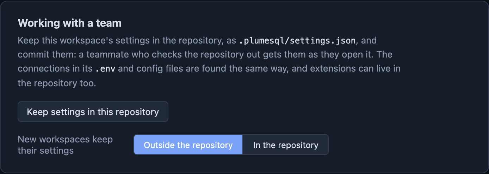

# PlumeSQL 0.22.1

Windows catches up, your team gets one place for its settings, and
PlumeSQL now opens right where you left off.

## The terminal comes to Windows

The integrated terminal now runs on Windows too, with PowerShell by
default. So do the command extensions, which means that on Windows you
can now:

- open **psql** on any connection, right inside PlumeSQL
- **back up** and **restore** a database with pg_dump and pg_restore
- **export** a table or a query straight to a CSV file

Stopping a run stops everything it started, the way it does on macOS
and Linux.

## One title row, as in VS Code

PlumeSQL on Windows now has a single title row in your theme's colours,
the way VS Code does: the menus on the left, your workspace in the
middle, and the minimize, maximize and close buttons on the right. No
more white system title bar and separate menu bar above the app. In a
narrow window the menus fold into one button, and Alt or F10 takes you
to them from the keyboard.

## PostgreSQL client tools in one click

Command extensions need psql, pg_dump and friends. The System page now
installs them for you on Windows as well: pick a version under
**Client tools** and PlumeSQL runs the official PostgreSQL installer
with only the command line tools. No server, no Windows service, no
pgAdmin. Each offer says what it downloads before it runs.

And if a command extension cannot find the tool it needs, or yours is
too old for the server, its message in the Log has a **Client Tools**
button that takes you straight there.

## Back where you left off

Start PlumeSQL from the Dock, the Start menu or your launcher and it
opens the workspace you used last, the way VS Code does.

Right-click the PlumeSQL icon (in the Dock on macOS, on the taskbar on
Windows, in your launcher on Linux) to see the workspaces you opened
recently, and open any of them in its own window.

## Share your settings with your team

Workspace settings can now live in the project's repository, as
`.plumesql/settings.json`. Commit the file and everyone who checks out
the project gets the same settings.

The new **Working with a team** card on the Welcome tab does it in one
click, and lets you choose where new workspaces keep their settings.
You can also do it from the command palette (Store Workspace Settings
in the Repository) or by right-clicking the workspace in the Explorer.
Once the file is there, the Explorer shows it, and the switch at the top
of the Settings page names the workspace you are changing.

## Also in this release

- **Connections tell the truth sooner.** Change a connection in your
  `.env` (or edit one in the Vault) and PlumeSQL checks it right away: a
  red dot and a note in the Log if the new settings do not connect. Your
  project's connections are also checked once when PlumeSQL starts, so a
  server that is down shows as down before you run anything.
- **`plumesql --help` reads well.** Examples first, then the options
  grouped by what they do. And a reminder: `plumesql -browser .` runs
  PlumeSQL in a tab of your browser instead of the desktop app.
- **Calmer pressed buttons.** An extension button whose tab is open is a
  simple tinted chip now, without the outline and the underline.

## Fixed

- The System page opens on Windows again.
- The note at the top of the Extensions tab reads well at any sidebar
  width.
- The sidebar tab labels look clean on Windows and Linux at 100% display
  scaling.
- Moving workspace settings back out of the repository no longer makes
  them look lost.
- The desktop File, New menu names what it creates: a grid, query or
  command extension.

## Tell us what you think

Questions and ideas go to
[Discussions](https://github.com/hercstack/plumesql/discussions), bugs to
[Issues](https://github.com/hercstack/plumesql/issues) or Report a Bug in
the app's menu. The video tour is on
[YouTube](https://www.youtube.com/@plumesql).
