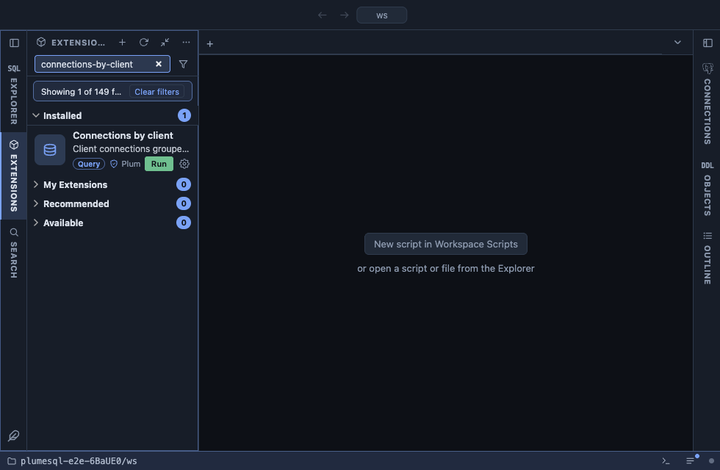

# Connections by client

Every client connection to the server, grouped by user, application and
client address, with how many of each are active, idle or idle in a
transaction, against `max_connections`. It answers which application
holds the connections, whether a pool leaks, and how close the server
is to refusing new ones.

## What it shows

A first row for all clients together, then one row per user,
application and address, the most connections first:

| Column | Meaning |
|---|---|
| user, application | The role and the `application_name` the client set. |
| client | The client's address, or `local socket`. On the first row, `max_connections` and the connections reserved for superusers. |
| connections | How many are open. |
| % of max | Their share of `max_connections`. |
| active, idle, idle in transaction | By state; `idle in transaction` holds locks and snapshots and is the one to watch. |
| other | Any other state, such as a fast-path function call, or a state hidden from this role. |
| oldest connected | When the oldest of them connected. |

**Sessions** on a row's connection count opens its backends one by one:
pid, database, state, when it connected, time in its current state and
its last statement. On the first row it opens every client connection.

## Requirements

PostgreSQL 13 or newer. Only client backends count: replication
senders, autovacuum and background workers have limits of their own.
Seeing other users' states and statements needs the
`pg_read_all_stats` role or superuser.

## Notes

Reads only. The share of `max_connections` leaves out the reserved
superuser slots (`superuser_reserved_connections`), so ordinary roles
are refused before the total reaches 100 %.
