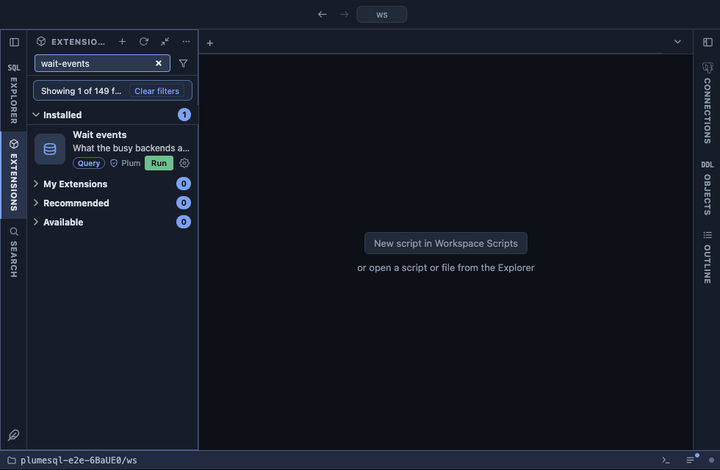

# Wait events

What the busy backends of the server are waiting on right now, grouped
by wait event, refreshed every five seconds while the tab is visible.
One glance tells a lock pile-up (`Lock`) from a disk that cannot keep up
(`IO`), a starved WAL writer (`LWLock` on WAL), a client that stopped
reading (`Client`) or plain CPU work.

## What it shows

One row per wait event type and event, the most backends first:

| Column | Meaning |
|---|---|
| type | The wait event type (`Lock`, `LWLock`, `IO`, `IPC`, `Client`, `Timeout`, `BufferPin`, `Extension`), or `CPU` for an active backend waiting on nothing. |
| event | The wait event (`relation`, `transactionid`, `DataFileRead`, `WALWrite`, ...), or `running` under `CPU`. |
| backends | How many backends wait on it now. |
| pids | Their pids, the longest waiting first. |
| backend types | Client backends, autovacuum workers, WAL senders, ... |
| longest in state | The longest time one of them has been in its current state. |
| example query | The statement of the longest waiting one, verbatim. |

**Backends** on an event opens every backend behind that row: user,
database, state, time in state, the pids it is blocked by (for a lock
wait, from `pg_blocking_pids()`), and its statement.

Left out, because they wait by design: idle sessions waiting for their
client's next statement, and background processes waiting for work
(wait type `Activity`).

## Requirements

PostgreSQL 13 or newer. Seeing other users' statements needs the
`pg_read_all_stats` role or superuser; without it the query columns show
`<insufficient privilege>`.

## Notes

Refreshes every 5 seconds (`@refresh 5s`), only while its tab is the
active one. It is a sample of one moment: a wait that comes and goes in
milliseconds shows only now and then, and a steady row across refreshes
is the one that matters. Reads only; Blocking locks has the buttons for
a lock that must be broken.
