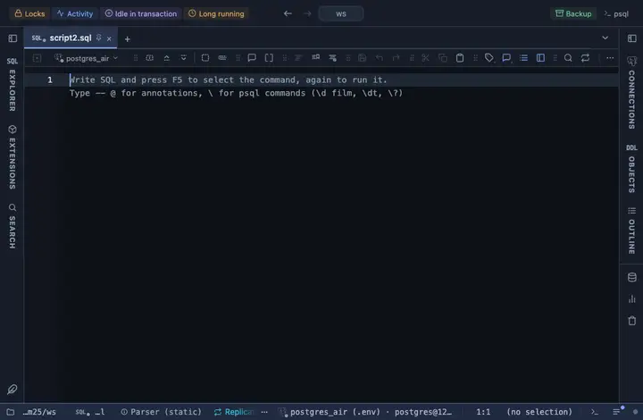

# Activity chart

The backends of a Current activity result as a rolling graph: total, active, idle, in transaction and waiting, one sample per refresh. The pgAdmin dashboard's "Server sessions" graph, drawn by hand with no library, moving under `@refresh` while the grid a click away lists the backends behind the newest point.

## What it shows

A **Chart** tab beside the grid. Every render is one SAMPLE: the rows are counted by state and the counts join a rolling series drawn as lines over time. It works on any result with a state column (the input names it; the default is pg_stat_activity's own `state`); a waiting column, when the result has one, adds the waiting series. The series lives for the tab's life: a hidden tab does not refresh, so it has gaps where nobody looked, and the header's Reset starts it over.

## Inputs

| Input | `@inputs` key | Default | Meaning |
|---|---|---|---|
| State column | `state` | state | The column read as the backend state (active, idle, idle in transaction) |
| Waiting column | `wait` | waiting | An active row with a non-empty value here counts as waiting; a result without the column has no waiting series |
| Samples kept | `keep` | 200 | How many refreshes the graph remembers; under @refresh 3s, 200 is ten minutes |

## Requirements

PostgreSQL 13 or newer. Nothing on the server: the view runs in the result's sandbox.

## Notes

Installed with Current activity, which attaches it with `-- @extension activity-chart as Chart` above its query and `@refresh 3s`; it draws with no dialog, every input has a default. Attach it from a script with `-- @extension activity-chart` above a query (add `open`, `only` or `beside` to open on the view), or from a result's own menu; the extension's page in PlumeSQL lists the lines to paste, and `-- @inputs` answers the inputs in the file so the chart draws with no dialog.
