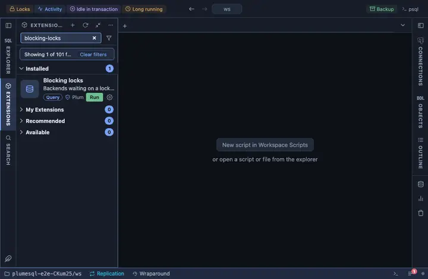

# Blocking locks

Backends waiting on a lock, each beside the backend that holds it,
refreshed every five seconds while the tab is visible. The question it
answers is the one a stalled application asks first: who is waiting, on
whom, for how long, and what are both of them running.

## What it shows

One row per waiting backend and the backend blocking it, from
`pg_stat_activity` joined through `pg_blocking_pids()`:

| Column | Meaning |
|---|---|
| waiter | The pid of the backend that waits. |
| waiter user | Who it runs as. |
| waiting for | How long it has been waiting, to the second. |
| blocker | The pid of the backend holding the lock it needs. |
| blocker user, blocker state | Who holds it and what that backend is doing now (`idle in transaction` is the usual culprit). |
| waiting query, blocking query | The two statements, verbatim. |

A blocker often holds up more than one row. **Everything it blocks** on
the blocker's pid opens a second grid with every backend waiting behind
that one pid, which is the true size of the problem.

**Terminate blocker** on a row asks first, then runs
`pg_terminate_backend()` on the blocker. Any transaction it holds is
rolled back, which is what releases the lock.

## Requirements

PostgreSQL 13 or newer. Seeing other users' queries needs the
`pg_read_all_stats` role or superuser; without it the query columns show
`<insufficient privilege>`. Terminating a backend needs
`pg_signal_backend` or superuser.

## Notes

Refreshes every 5 seconds (`@refresh 5s`), only while its tab is the
active one. Ships pinned to the title bar as "Locks" (`@toolbar`) and
opens on its result (`@face result`). The main query reads only; the one
button that writes asks before it acts.
