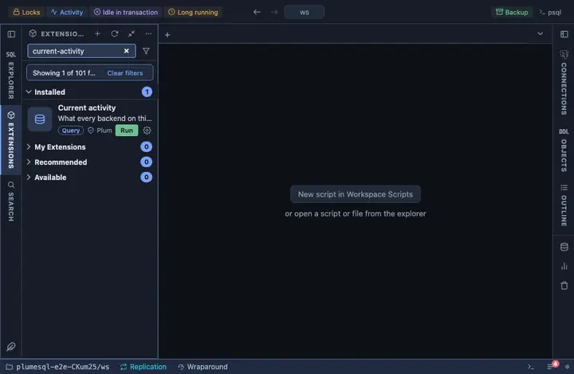

# Current activity

What every backend on this database is doing right now, refreshed every
three seconds while the tab is visible: the pgAdmin dashboard's sessions
table, with the pid as the door to what each session holds and waits for,
and Cancel and Terminate one confirmation away. Pinned to the title bar
as "Activity", the first thing to open when a database feels slow.

## What it shows

One row per backend on the current database (this action's own dial is
left out), active ones first, then by when the statement started:

| Column | Meaning |
|---|---|
| pid | The backend's process id; a click opens its locks. |
| user | Who it runs as. |
| state | `active`, `idle`, `idle in transaction`, and so on, as `pg_stat_activity` reports it. |
| elapsed | How long the current or last statement has been running, to the second. |
| waiting | The wait event type when the backend is waiting on something (a lock, IO, a client). |
| query | The statement, verbatim. |

**Chart**: a second tab beside the grid, drawn by the Activity chart
extension (installed with this one): one sample per refresh, sessions by
state over time, the dashboard's graph.

**Locks** on a pid opens a second grid, one step deeper: every lock that
backend holds or waits for, with the relation, the mode and whether it is
granted. **Cancel query** asks first, then cancels the running statement
(`pg_cancel_backend`); **terminate** asks first, then ends the backend
and rolls back whatever it held (`pg_terminate_backend`).

## Requirements

PostgreSQL 13 or newer. Seeing other users' statements needs the
`pg_read_all_stats` role or superuser; without it the query column reads
`<insufficient privilege>`. Cancelling or terminating another user's
backend needs `pg_signal_backend` or superuser. The Chart tab loads the
Activity chart extension, which draws with no library beyond the app.

## Notes

Refreshes every 3 seconds (`@refresh 3s`), only while its tab is the
active one; the chart keeps one sample per refresh. Opens on its result
(`@face result`). The main query and the locks drill-down read only; the
two buttons are what writes, and each asks before it acts.
