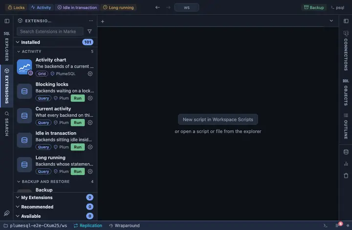

# Idle in transaction

Backends sitting idle inside an open transaction, oldest first. They
hold their locks and keep vacuum from cleaning up behind them until
they commit or roll back, which is why one forgotten transaction can
slow a whole database. Pinned to the title bar beside Activity: one
glance says whether anything is sitting open.

## What it shows

One row per backend in `idle in transaction` or `idle in transaction
(aborted)`:

| Column | Meaning |
|---|---|
| pid | The backend's process id. |
| user | Who it runs as. |
| application | The `application_name` it connected with, often the surest clue to which service left it open. |
| in transaction for | How long the transaction has been open. |
| idle for | How long since the backend last did anything. |
| last statement | The last statement it ran, verbatim. |

**Terminate** on a row asks first, then ends that backend with
`pg_terminate_backend`; its open transaction is rolled back, which is
what releases the locks.

## Requirements

PostgreSQL 13 or newer. Seeing other users' statements needs the
`pg_read_all_stats` role or superuser. Terminating another user's
backend needs `pg_signal_backend` or superuser.

## Notes

Refreshes every 10 seconds (`@refresh 10s`) while its tab is the active
one. Opens on its result (`@face result`). Reads only, except for the
button, which asks first. A server-side guard for the same problem is
`idle_in_transaction_session_timeout`.
