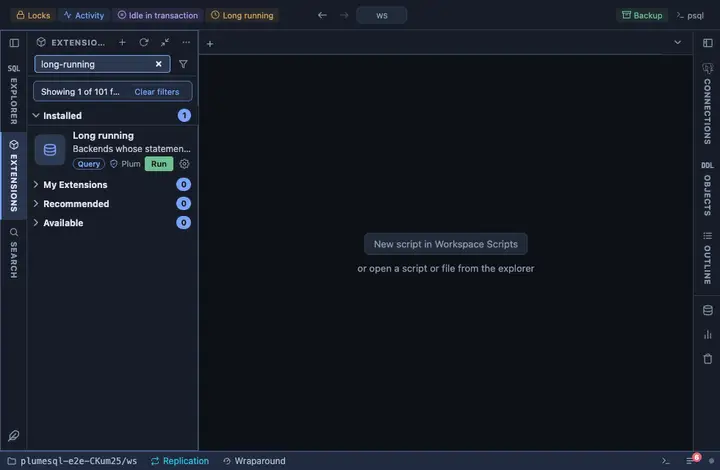

# Long running

Backends whose current statement has been running longer than a
threshold you give, oldest first, with Cancel and Terminate a
confirmation away. Pinned to the title bar as "Long running"; it asks
for the threshold before it runs.

## What it shows

One row per ACTIVE backend whose statement started earlier than the
threshold. Only active ones on purpose: a backend idle in a transaction
shows the start of its last statement, long finished, and would pass for
a running one (Idle in transaction is the extension for those).

| Column | Meaning |
|---|---|
| pid | The backend's process id. |
| user, database | Who runs it, and where. |
| state | `active`. |
| elapsed | How long the statement has been running, to the second. |
| waiting | The wait event type, when it is waiting rather than working. |
| query | The statement, verbatim. |

**Cancel** asks first, then cancels the statement (`pg_cancel_backend`),
leaving the backend and its transaction alive. **Terminate** asks first,
then ends the backend (`pg_terminate_backend`) and rolls its transaction
back.

## Inputs

| Input | Default | Meaning |
|---|---|---|
| seconds | 30 | Running longer than this many seconds. |

## Requirements

PostgreSQL 13 or newer. Seeing other users' statements needs the
`pg_read_all_stats` role or superuser. Cancelling or terminating another
user's backend needs `pg_signal_backend` or superuser.

## Notes

Refreshes every 5 seconds (`@refresh 5s`) while its tab is the active
one, with the threshold you gave. Opens on its result (`@face result`).
Reads only, except for the two buttons, which ask first.
