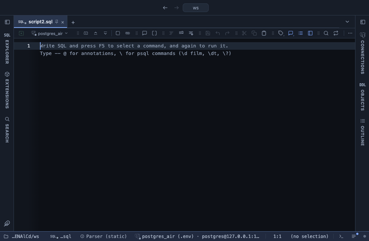

# Cohorts

A retention table: users grouped by the period of their first event, and the share still active in each period after, as a heatmap. Whether the customers who signed up in March came back in April, May and June, and whether later cohorts stay longer than earlier ones.

## What it shows

A **Cohorts** tab beside the grid, itself a grid. One row per cohort, the users whose first event fell in that day, week or month, labelled with the period's first day, with the cohort's size. Then one column per period since: `month 0` is the first period (100% by definition), `month 1` the next, and so on. Each cell is the share of the cohort with at least one event in that period, tinted with the theme's accent, deeper the higher. A period after the latest event in the result is blank, not 0: it has not happened yet. Hovering a cell gives the count and the period's date.

The **All** line at the bottom weighs every cohort by its size, over the cohorts old enough to have that period, so a young cohort does not pull a late column down.

## Inputs

| Input | `@inputs` key | Default | Meaning |
|---|---|---|---|
| User | `user` | asked | The column that tells one user (a customer, an account) from another |
| Event time | `time` | asked | The date or timestamp of each event; a user's first one decides the cohort |
| Period | `period` | month | day, week or month: the length of a cohort and of each step after it |
| Show | `value` | percent | percent: the share of the cohort active in that period; count: how many of its users were |
| Periods | `periods` | 12 | How many periods after the first get a column |

## Requirements

PostgreSQL 13 or newer. No server side: the result's sandbox computes it from the rows already fetched. It installs with **stats-core**, the shared helper library of the Analysis extensions.

## Notes

The result is one row per event (a login, an order), with the user and the time: `select customer_id, ordered_at from orders`. Rows are read in any order. Times are bucketed in UTC and weeks start on Monday, as `date_trunc` does; a month steps by the calendar. Rows with no user or no readable time are left out and the Log says how many. From a script: `-- @extension cohorts` above the query, with `-- @inputs user=customer_id, time=ordered_at, period=week`.
