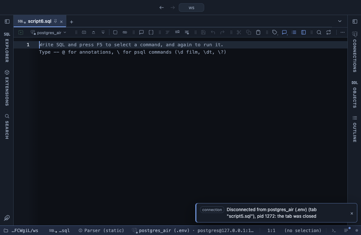

# Correlation

Pearson or Spearman correlation between numeric columns, as a coloured matrix or a ranked list of pairs, in the grid. Which numeric columns move together, and how closely, before you reach for a scatter plot.

## What it shows

A **Correlation** tab beside the grid, itself a grid. As a matrix: one row and one column per picked column, each cell the correlation coefficient r between the two, from 1 (they rise together in step) through 0 (no relation) to -1 (one falls as the other rises). Positive cells are tinted with the theme's accent colour and negative ones red, deeper the stronger; hovering a cell shows r and n, the number of rows it was computed from. As pairs: one row per pair of columns with r, n and a word for the strength (weak below 0.3, moderate below 0.7, strong from there), strongest first whatever the sign.

## Inputs

| Input | `@inputs` key | Default | Meaning |
|---|---|---|---|
| Columns | `columns` | every numeric column | Numeric columns to correlate, as a comma list (up to 30) |
| Method | `method` | pearson | pearson measures a straight line; spearman any steady rise or fall, by ranks, and is less moved by outliers |
| Output | `output` | matrix | matrix is every column against every other; pairs is one row per pair, strongest first |

## Requirements

PostgreSQL 13 or newer. No server side: the result's sandbox computes it from the rows already fetched. It installs with **stats-core**, the shared helper library of the Analysis extensions.

## Notes

Each pair uses the rows where both of its values are present, so two pairs may rest on a different n. Fewer than three such rows, or a column that never changes, leaves the cell empty. Correlation is not causation, and r only sees what its method looks for: a U shape reads close to 0 under both. From a script: `-- @extension correlation` above the query, with `-- @inputs method=spearman, output=pairs`. The pairs form pipes on: `-- @extension correlation | echarts` with `-- @inputs output=pairs` and `-- @inputs echarts: kind=bar, x=b, series=r`.
