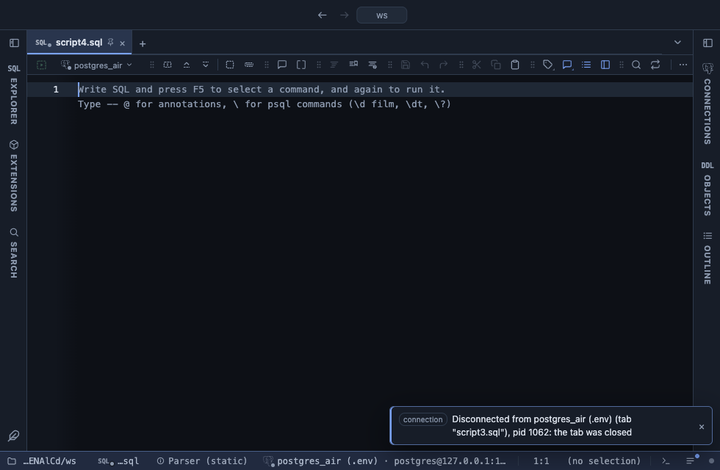

# Data quality

One row per column with its checks: nulls, empty strings, key duplicates, unparsed values, stray spaces, case variants, odd dates. The questions to ask a table before trusting a report built on it, over the whole result, with a status per column.

## What it shows

A **Data quality** tab beside the grid, itself a grid, one row per column of the result:

- **family**: what the column holds, from its type (number, date, boolean, uuid, json, text, array); a text column whose values are 90% or more numbers, dates or booleans reads as that family with `(looks like)`.
- **status**: `fail` (red), `check` (amber) or `ok` (green); hovering it lists what was found, and the **issues** column says the same in words.
- **nulls** and **null %**; **empty**, the empty strings of a text column; **distinct**, the count of different values.
- **key**: `yes` when the column looks like a key: named `id`, `uuid`, `guid` or `key`, or the first column named `…_id` or nearly unique (99% or more over 20 rows or more), or a nearly unique uuid. **key repeats**: the rows beyond the first that repeat a key value. A NULL or a repeat in a key is a fail.
- **unparsed**: values that do not read as the column's family (a boolean `yes!`, a number `n/a` in a text column of numbers). A fail when the type declares the family, a check when it is only what the values look like.
- **spaces**: values with leading or trailing spaces. **case variants**: values written in more than one case (`Zagreb` and `zagreb`), counted once for each set of spellings.
- **dates out of range**: dates and timestamps before Earliest date or after Latest date, including `infinity` and BC dates: the sentinels (`0001-01-01`, `9999-12-31`) and typed wrong years.

Also a check: a column that is always NULL, or one value throughout. Every count with a finding is coloured and its hover text shows up to three examples.

## Inputs

| Input | `@inputs` key | Default | Meaning |
|---|---|---|---|
| Earliest date | `from` | 1900-01-01 | A date or timestamp before this is out of range |
| Latest date | `to` | 2100-12-31 | A date or timestamp after this is out of range; a day includes the whole day |

## Requirements

PostgreSQL 13 or newer. No server side: the result's sandbox computes it from the rows already fetched. It installs with **stats-core**, the shared helper library of the Analysis extensions.

## Notes

Run `select * from the_table` and open Data quality; a LIMIT checks the sample, not the table. Distinct values are counted up to 200,000 per column (then `≥`), and past that cap key repeats and case variants are left blank. A guessed key is only a guess: a column called `id` in a join result may repeat by design. Profile answers the neighbouring question, how the values are spread. From a script: `-- @extension data-quality` above the query, with `-- @inputs from=2000-01-01, to=2030-12-31`.
