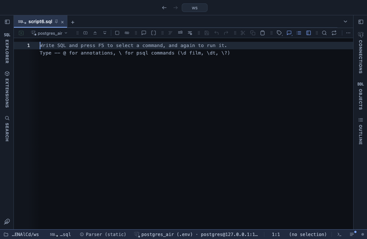

# Duplicates

Finds rows repeated on the key columns you pick, or on every column: each repeated key with its count and row numbers, or the result marked. Before a unique index, a merge or a join that should not fan out: which keys appear more than once, how often and where.

## What it shows

A **Duplicates** tab beside the grid, itself a grid. As groups: one row per key that appears more than once, the most repeated first (ties in the order the keys first appear), with the key columns' values, the count of rows that carry it, their row numbers in the result (from 1; the first 50, then how many more) and the first row's number. As marked: every column and row of the result in its order, with the key cells of every repeated row coloured amber, the first row of a key lighter than its repeats; hovering one says which it is, for example `Repeat 2 of 3 rows with this key: rows 1, 3, 5`. Each cell keeps its original value, so copy, filter and export read the data.

The Log says how many keys repeat, how many rows carry them, and how many rows are beyond the first of each: what a dedupe that keeps the first would drop.

## Inputs

| Input | `@inputs` key | Default | Meaning |
|---|---|---|---|
| Key columns | `columns` | every column | Columns whose values together make a row's key, as a comma list; blank compares every column, finding whole rows repeated |
| Output | `output` | groups | groups: one row per repeated key, the most repeated first; marked: the result with the key cells of repeated rows coloured |

## Requirements

PostgreSQL 13 or newer. No server side: the result's sandbox computes it from the rows already fetched. It installs with **stats-core**, the shared helper library of the Analysis extensions.

## Notes

Values compare as the server sent them: exactly, case and spaces included, so `Zagreb` and `zagreb ` are two keys (Data quality finds those). Two NULLs count as the same key, as `GROUP BY` and `DISTINCT` treat them, though a unique index would let both in. The grid lists the first 100,000 rows or keys; the counts read every row.

The marked copy is a tab, not a formatting rule on the result itself: a rule sees one row at a time, and a repeat needs the whole result.

From a script: `-- @extension duplicates` above the query, with `-- @inputs columns=email` or `-- @inputs columns=customer_id, order_date, output=marked`. The SQL that answers the same: `select key, count(*) from t group by key having count(*) > 1`.
