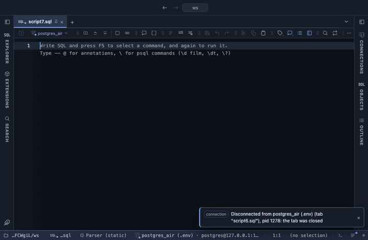

# Forecast



Continues a time series a number of steps ahead with a 95% band, by Holt's trend or a straight line, in the grid. A quick look at where a series is heading if it keeps going as it has, and how wide the uncertainty is.

## What it shows

A **Forecast** tab beside the grid, itself a grid: the series in time order, one row per point with its `actual` value, then Steps ahead rows with the `forecast` and a 95% band from `low` to `high`, which widens with every step. The `kind` column says which is which. The last actual row carries the forecast and the band too, set to its actual value, so on a chart the forecast line starts where the actual one ends. The Log gives the residual spread of the fit (and r² for linear), a measure of how well the method followed the past.

## Inputs

| Input | `@inputs` key | Default | Meaning |
|---|---|---|---|
| Time | `time` | the first date or timestamp column | The date or timestamp column; blank takes the first one, or the row order when there is none |
| Value | `value` | the first numeric column | The numeric column continued ahead |
| Steps ahead | `horizon` | 12 | How many steps the forecast runs past the last row (up to 1000) |
| Method | `method` | holt | holt follows a trend that may bend (double exponential smoothing, weights fitted to the series); linear continues one straight line |
| Step | `unit` | auto | How far apart the future points are: minute to year, or auto to read it from the gaps in the series |

## Requirements

PostgreSQL 13 or newer. No server side: the result's sandbox computes it from the rows already fetched. It installs with **stats-core**, the shared helper library of the Analysis extensions.

## Notes

It expects one row per moment at a regular step; resample first when the rows are events: `-- @extension resample | forecast`. No seasonality: a yearly pattern is continued as a trend, not repeated. The band assumes the errors are steady and independent, so read it as a rough range. Times come out in UTC. At least three points are needed. From a script: `-- @extension forecast` above the query. Charted, with the band as two lines:

```sql
-- @extension forecast | echarts
-- @inputs value=revenue, horizon=12
-- @inputs echarts: kind=line, x=time, series=actual,forecast,low,high
```
