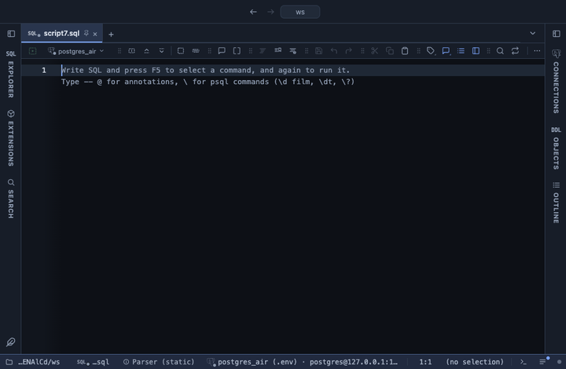

# Frequencies

The most frequent values of a column with count, percent and cumulative percent, the rest in an Other line, in the grid. What a column mostly holds, how concentrated it is, and how many values make up most of the rows.

## What it shows

A **Frequencies** tab beside the grid, itself a grid: one row per value, the most frequent first (ties by value, numbers as numbers), with its count, its share of all counted rows, the running share from the top, and a bar scaled to the most frequent value. Past the top N, the remaining values are counted together in an **Other** line that says how many values it holds, and a **Total** line gives every counted row and the number of distinct values. Both are frozen at the bottom.

## Inputs

| Input | `@inputs` key | Default | Meaning |
|---|---|---|---|
| Column | `column` | asked | The column whose values are counted |
| Top values | `n` | 20 | How many of the most frequent values get a line; the rest are counted together under Other |
| Nulls | `nulls` | count | count: NULL is a value like any other; skip: NULLs are left out of the counts and the percentages |

## Requirements

PostgreSQL 13 or newer. No server side: the result's sandbox computes it from the rows already fetched. It installs with **stats-core**, the shared helper library of the Analysis extensions.

## Notes

Values count as the server sent them, exactly: case and spaces make two values of one word. The value column is text, so the Other and Total lines fit in it and a chart after a pipe takes it for the categories: `-- @extension frequencies | bar-chart`. From a script: `-- @extension frequencies` above the query, with `-- @inputs column=status, n=10`. For a numeric column spread over many values, Histogram counts ranges instead.
