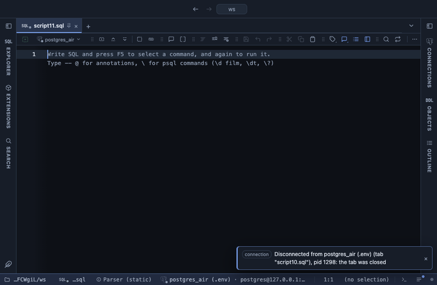

# Histogram

Counts a numeric column in evenly wide bins, with percentages, a running share and a bar per bin, in the grid. How a numeric column is spread: where most values sit, how long the tails are, whether there are two humps.

## What it shows

A **Histogram** tab beside the grid, itself a grid: one row per bin, labelled like `10 to 20`, with its lower and upper edge as numbers, the count of values in it, its share of all values, the running share from the first bin, and a bar scaled to the fullest bin. A bin holds values from its lower edge up to, not including, its upper edge. With Split by, each of the 12 most common values of that column gets a count column of its own before the total count, and the rest are counted together under `other`. The Total row is frozen at the bottom.

## Inputs

| Input | `@inputs` key | Default | Meaning |
|---|---|---|---|
| Column | `column` | the first numeric column | The numeric column counted into bins |
| Bins | `bins` | automatic | How many bins, roughly; the width is rounded to 1, 2 or 5 times a power of ten so the edges read well. Blank uses Sturges' rule |
| Bin width | `width` | none | An exact bin width; when set it wins over Bins |
| Split by | `group` | none | Column whose values each get a count column of their own |

## Requirements

PostgreSQL 13 or newer. No server side: the result's sandbox computes it from the rows already fetched. It installs with **stats-core**, the shared helper library of the Analysis extensions.

## Notes

Nulls and values that do not read as numbers are skipped, and the Log says how many. At most 1000 bins: a width too small for the range asks for a wider one. From a script: `-- @extension histogram` above the query, with `-- @inputs column=amount, width=10`. The `bin` column comes first so a chart after a pipe takes it for the categories: `-- @extension histogram | bar-chart` or `-- @extension histogram | echarts` with `-- @inputs echarts: kind=bar, x=bin, series=count`.
