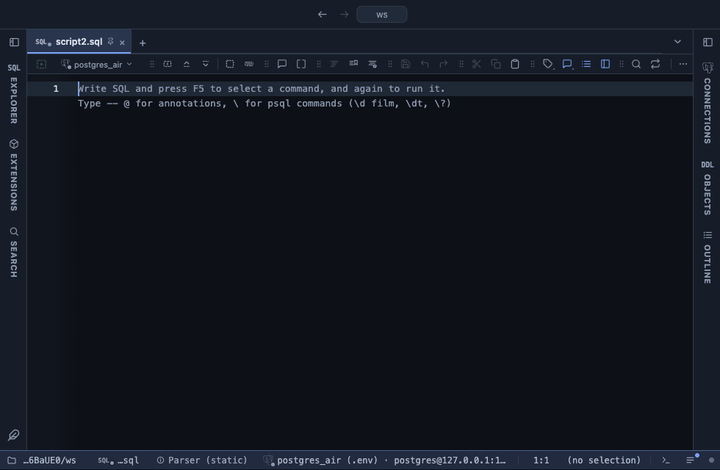

# Outliers

Flags outliers of the numeric columns you pick, by IQR fences or z-score: a list of the outlying values, or the result with them coloured. The values a chart would stretch its axis for, a typo that added three zeros, the one order that skews the mean: found over the whole result, with the reason beside each.

## What it shows

An **Outliers** tab beside the grid, itself a grid. As a list: one row per outlying value, the furthest out first, with its row number in the result (from 1), the column, the value, its side (`high` or `low`), the limit it crossed, how far past that limit it is, and its score, followed by every column of the row so the record can be told apart. As marked: every column and row of the result in its order, with the outlying cells coloured, red for a high value and amber for a low one; each cell keeps its original value, so copy, filter and export read the data. Hovering a flagged cell says why, for example `above the upper fence 14.5 (Q3 7.75 + 1.5 × IQR 4.5), 19 IQRs past it`.

Each column is judged on its own, over every row the view reads.

- **iqr** (Tukey's fences): the quartiles Q1 and Q3 and the interquartile range IQR = Q3 - Q1; a value below Q1 - k × IQR or above Q3 + k × IQR is out. The score is how many IQRs past the fence it lies. It does not assume a bell curve and is not moved by the outliers themselves.
- **z-score**: the mean and the sample standard deviation; a value whose distance from the mean is more than the threshold in standard deviations is out. The score is its z. It suits roughly bell shaped data; one huge value inflates the standard deviation and can hide itself.

## Inputs

| Input | `@inputs` key | Default | Meaning |
|---|---|---|---|
| Columns | `columns` | asked | Numeric columns whose outliers are flagged, each judged on its own, as a comma list |
| Method | `method` | iqr | iqr or z-score |
| IQR multiplier | `k` | 1.5 | For iqr: how many IQRs beyond the quartiles the fences stand; 1.5 is Tukey's, 3 flags only the far out |
| Z threshold | `z` | 3 | For z-score: a value further than this many standard deviations from the mean is an outlier |
| Output | `output` | list | list: one row per outlying value, the furthest out first; marked: the result with the outlying cells coloured |

## Requirements

PostgreSQL 13 or newer. No server side: the result's sandbox computes it from the rows already fetched. It installs with **stats-core**, the shared helper library of the Analysis extensions.

## Notes

Quartiles interpolate between ranks, as PostgreSQL's `percentile_cont` and a spreadsheet's QUARTILE.INC do. Nulls and values that do not read as numbers are skipped; a column with fewer than three numbers, or a standard deviation of 0 under z-score, is left alone and the Log says so. With an IQR of 0 (most values the same) every other value is out, and the score is its plain distance. The Log gives the count per column. The grid lists the first 100,000 rows; the limits read every row.

The coloured copy is a tab, not a formatting rule on the result itself: a rule sees one row at a time, and a fence needs the whole column.

From a script: `-- @extension outliers` above the query, with `-- @inputs columns=amount, method=z-score, z=2.5` or `-- @inputs columns=amount, output=marked`.
