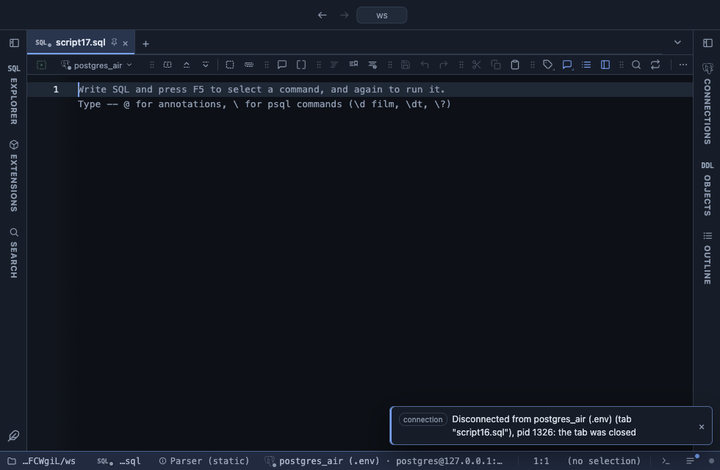

# Resample

Folds rows into regular time buckets, a minute to a year, with the gaps filled, over the whole result, in the grid. The time series behind a chart: events per hour, revenue per week, a daily mean, with the quiet days present instead of missing.

## What it shows

A **Resample** tab beside the grid, itself a grid: one row per bucket from the first to the last, each labelled with the moment it starts (a date for a day or longer, a timestamp for a minute or an hour), then one column per value column, folded over the rows that fall in the bucket (`sum of amount`), or `rows` for a count. A bucket with no rows is filled by the Empty buckets choice. With Split by, each of the 20 most common values of that column gets a column of its own, holding the first value column folded (or a row count).

## Inputs

| Input | `@inputs` key | Default | Meaning |
|---|---|---|---|
| Time | `time` | the first date or timestamp column | The date or timestamp column the buckets are cut from |
| Bucket | `unit` | day | minute, hour, day, week, month, quarter or year; weeks start on Monday |
| Values | `value` | none | Numeric columns folded per bucket, as a comma list; blank counts rows |
| Fold | `agg` | sum | count, sum, mean, median, min, max, stdev, p90 or distinct |
| Empty buckets | `fill` | zero | What a bucket with no rows shows: 0, nothing, or the bucket before it |
| Split by | `group` | none | Column whose values each get a column of their own |

## Requirements

PostgreSQL 13 or newer. No server side: the result's sandbox computes it from the rows already fetched. It installs with **stats-core**, the shared helper library of the Analysis extensions.

## Notes

Times are read as the server sent them and bucketed in UTC, so a `timestamptz` column is cut at UTC midnights whatever the session's time zone; for local days, convert in SQL first (`ts AT TIME ZONE 'Europe/Zagreb'`). Rows without a readable time are skipped, and the Log says how many. Up to 100,000 buckets. From a script: `-- @extension resample` above the query, with `-- @inputs time=created_at, unit=week, value=amount`. It feeds a chart or a forecast: `-- @extension resample | echarts`, `-- @extension resample | forecast`.
