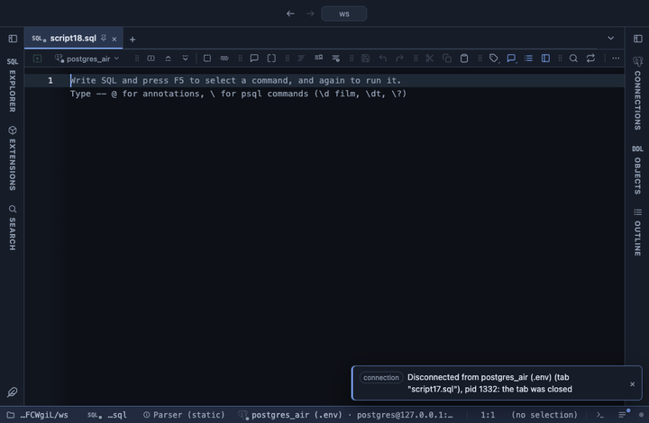

# Sample

A repeatable sample of the result's rows: random, every k-th, or the first of each group, in their original order, in the grid. A smaller result that still looks like the whole one, for a chart that would drown in points or a spot check of a big table.

## What it shows

A **Sample** tab beside the grid, itself a grid: the picked rows with every column of the result, of the same types, in the order they had in the result. random keeps every row with the same chance; systematic keeps every k-th row from a random start, spread evenly over the result; first-per-group keeps the first row of each value of the Group column, as in `DISTINCT ON`. The same seed on the same result draws the same rows, so a sample can be shown again. The Log says how many rows were kept of how many.

## Inputs

| Input | `@inputs` key | Default | Meaning |
|---|---|---|---|
| Rows | `n` | 1000 | How many rows the sample keeps |
| Percent | `percent` | none | A share of the rows instead of a count; when set it wins over Rows |
| Seed | `seed` | 42 | The same seed draws the same rows; change it for another sample |
| Method | `method` | random | random, systematic or first-per-group |
| Group | `group` | none | The column whose values form the groups, for first-per-group |

## Requirements

PostgreSQL 13 or newer. No server side: the result's sandbox computes it from the rows already fetched. It installs with **stats-core**, the shared helper library of the Analysis extensions.

## Notes

The sample is drawn from the rows the view reads (up to a million), not from the table on the server; for a sample of a huge table, `TABLESAMPLE` in SQL is cheaper. With first-per-group, Rows caps the number of groups, and the Log says when groups were left out. From a script: `-- @extension sample` above the query, with `-- @inputs n=500, seed=7`. It thins the input of a chart: `-- @extension sample | scatter-gl` or `-- @extension sample | echarts`.
