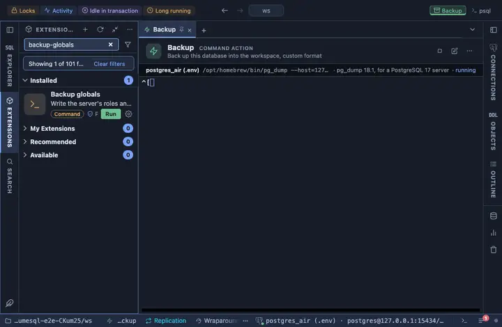

# Backup globals

Write the server's roles and tablespaces to a plain SQL file, and open
it. What a database backup never carries: roles and tablespaces live on
the SERVER, not in any one database, so a full recovery needs this file
beside the database archives.

## What it does

Runs `pg_dumpall --globals-only` on the tab's connection, in a terminal
of its own, and writes `globals-<timestamp>.sql` into the workspace; the
file opens in a tab the moment it is written. The connection's own
database is named (`--dbname`) on purpose: pg_dumpall would otherwise
dial `postgres`, then `template1`, which a hosted service's role may not
reach at all.

## Inputs

| Input | Default | Meaning |
|---|---|---|
| file | `globals-{timestamp}.sql` | The file's name in the workspace, declared once so the command and the opened file cannot disagree. |

The password reaches pg_dumpall through the environment (`@env
PGPASSWORD={password}`), never the command line.

## Requirements

`pg_dumpall` on this machine, at a version not older than the server's:
PlumeSQL finds every PostgreSQL client installation (System, Client tools, which also installs a missing one) and runs the one that suits the server, so nothing has to be on the PATH. A role that may read `pg_authid` (superuser, or `pg_read_all_data` on
recent servers; a hosted service may offer `--no-role-passwords`
instead). PostgreSQL 13 or newer.

## Notes

A command extension: it runs a program on your machine, not a query on
the server. Plain SQL, for reading; a second run never overwrites the
first, the name carries the moment it was taken.
