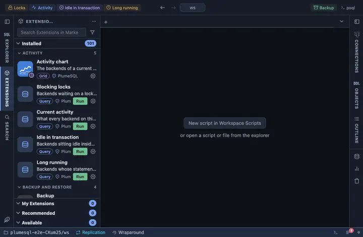

# Backup

Back up the connected database into the workspace directory as a
custom-format `pg_dump` archive, one click from any tab. For the "before
I touch this" moment: a restorable copy, named after the database and the
minute it was taken, without leaving PlumeSQL.

## What it does

Runs `pg_dump --format=custom` on the connection the tab is on and writes
`<database>-<YYYY-MM-DD_HH-MM-SS>.dump` into the workspace. The terminal
shows pg_dump's own output; when it finishes an alert names the file, and
when it fails the alert says the terminal has why and that the file is
missing or incomplete.

Custom format on purpose: it restores with `pg_restore`, which can pick
what to restore and in which order, and it sidesteps the plain-text
pipeline entirely. The companion **Restore** extension reads exactly this
archive.

## Inputs

| Input | Default | Meaning |
|---|---|---|
| dump | `{db}-{timestamp}.dump` | The archive's file name in the workspace, declared once so the question, the report and the command cannot disagree. |

The password never appears in the command line: it reaches pg_dump
through the environment (`@env PGPASSWORD={password}`), the only place a
command extension may spend it.

## Requirements

`pg_dump` on this machine, at a version not older than the server's:
PlumeSQL finds every PostgreSQL client installation (System, Client
tools, which also installs a missing one) and runs the one that suits
the server, so nothing has to be on the PATH. A connection whose user
may read every object it is asked to dump. PostgreSQL 13 or newer.

## Notes

This is a command extension: it runs a program on your machine, not a
query on the server. It asks before it runs (`@confirm`) and reports
success or failure with an alert. Ships pinned at the title bar's right
end as "Backup" (`@toolbar end`). It writes into the WORKSPACE directory,
so a backup taken in a repository lands beside its files; move or ignore
it as you would any generated file.
