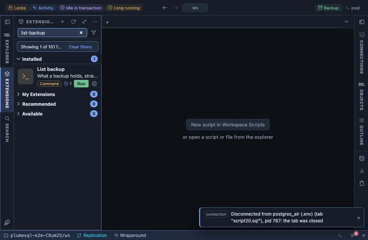

# List backup

What a backup holds, straight from its table of contents: `pg_restore
--list` over a custom-format archive, in a terminal. The look before a
restore, and the way to tell two archives apart.

## What it does

Asks which archive to read (the workspace's files, newest first) and
runs `pg_restore --list` on it. Only the archive is read: nothing touches
a database, which is why this one asks no question and needs no
connection picked at all.

## Inputs

| Input | Default | Meaning |
|---|---|---|
| dump | asked | The backup to read, picked from the workspace. |

## Requirements

`pg_restore` on this machine: PlumeSQL finds every PostgreSQL client installation (System, Client tools, which also installs a missing one) and runs the one that suits the server, so nothing has to be on the PATH. An archive pg_dump wrote in custom
(or directory, or tar) format; a plain SQL dump has no table of contents.

## Notes

A command extension: it runs a program on your machine. The listing is
what `pg_restore --use-list` takes, so the terminal's output is also the
start of a selective restore.
