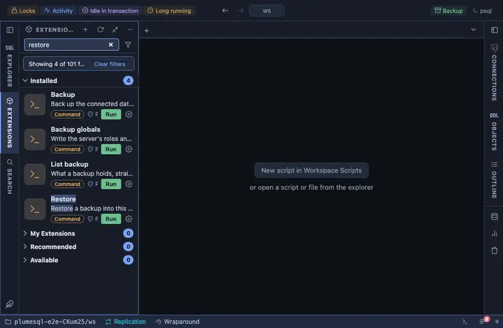

# Restore

Restore a custom-format backup into the connected database: the mirror
of the Backup extension, reading exactly the archive it wrote. It asks
first, drops what it is about to recreate, and reports how it ended.

## What it does

Asks which archive to restore (the workspace's files, newest first),
confirms, then runs `pg_restore --clean --if-exists --no-owner` on the
tab's connection, in a terminal of its own. `--clean --if-exists` drops
each object it is about to recreate, so a second restore lands on a
clean slate; `--no-owner` leaves the restored objects to whoever runs
the restore, so an archive from another machine does not insist on that
machine's roles. An alert reports success, or says that the terminal has
why it failed and that the database holds what did restore.

## Inputs

| Input | Default | Meaning |
|---|---|---|
| dump | asked | The archive to restore, picked from the workspace. |

The password reaches pg_restore through the environment (`@env
PGPASSWORD={password}`), never the command line.

## Requirements

`pg_restore` on this machine, at a version not older than the server's
(and not older than the pg_dump that wrote the archive): PlumeSQL finds every PostgreSQL client installation (System, Client tools, which also installs a missing one) and runs the one that suits the server, so nothing has to be on the PATH. A
connection whose user may create the objects the archive holds.
PostgreSQL 13 or newer.

## Notes

A command extension: it runs a program on your machine, not a query on
the server. It asks before it runs (`@confirm`) and names the database
and the host in the question, because this one writes. pg_restore names
each object it could not restore and ends with the count; those lines
are in the terminal.
