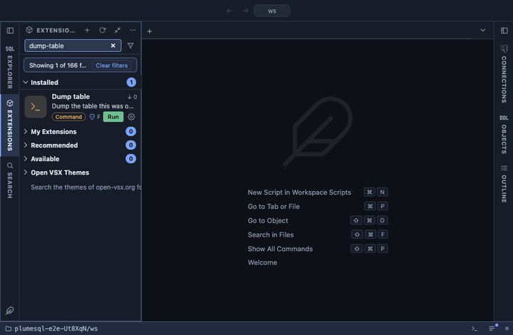

# Dump table

Dump one table into a plain SQL file named after it, from the table's
own row in the object tree: its definition and rows, the definition
alone, or the rows alone, with the rows as COPY or as INSERT statements.
The quick copy of one table before you touch it, the way to carry it to
another database, or a seed file of INSERTs, whatever the table's size.

## What it does

An `@for table` extension: it appears in the Actions submenu of every
table's row in the object tree and on an open table's header, and runs
`pg_dump --table=<the table> --file=<name>-<date>.sql` with the flags
you picked on the tab's connection, in a terminal of its own. The terminal shows pg_dump's own
output; when it finishes the file opens.

## Inputs

| Input | Default | Meaning |
|---|---|---|
| dump | `{name}-{date}.sql` | The file's name in the workspace, declared once so the question, the command and the opened file cannot disagree. |
| What to dump | definition and rows | `--format=plain` dumps both, `--schema-only` the definition alone, `--data-only` the rows alone. |
| Rows as | COPY | `--format=plain` writes the rows as COPY, the fastest to restore with psql; `--column-inserts` writes one INSERT statement per row, with the column names, which other tools and other databases read too. |

Each choice is the pg_dump flag itself, shown beside what it means, so
the command you see is the command that runs.

The password never appears in the command line: it reaches pg_dump
through the environment (`@env PGPASSWORD={password}`).

## Requirements

`pg_dump` on this machine, at a version not older than the server's:
PlumeSQL finds every PostgreSQL client installation (System, Client
tools, which also installs a missing one) and runs the one that suits
the server, so nothing has to be on the PATH. A connection whose user may
read the table. PostgreSQL 13 or newer.

## Notes

A command extension: it runs a program on your machine, not a query on
the server. It asks before it runs (`@confirm`) and writes into the
WORKSPACE directory, beside your files; move or ignore the file as you
would any generated one. Plain SQL format: readable, and restorable with
`psql`.
