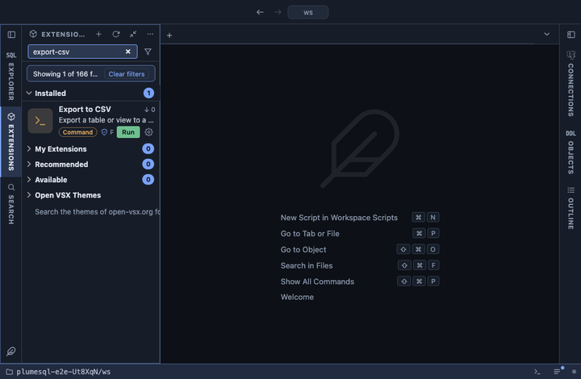

# Export to CSV



Export a table or a view to a CSV file, from its row in the object tree.
psql streams the rows straight into the file, so the size does not
matter: a table of fifty million rows exports the same way as one of
fifty, without passing through the grid or the copy limit.

## What it does

An `@for` extension on tables, views, materialized views and foreign
tables: it appears in the Actions submenu of their rows in the object
tree and on an open table's header, and runs psql's `\copy` on the tab's
connection, in a terminal of its own:

```
\copy (select * from <the table>) to stdout with (format csv, header)
```

with the output sent to the file you named. The file has a header line
with the column names, then one line per row, in PostgreSQL's own CSV:
NULL is an empty field, and a value with a comma, a quote or a line
break is quoted.

## Inputs

| Input | Default | Meaning |
|---|---|---|
| Write to | `{name}-{date}.csv` | The file to write, in the workspace unless you give a full path. |

The password never appears in the command line: it reaches psql through
the environment (`@env PGPASSWORD={password}`).

## Requirements

`psql` on this machine, at a version not older than the server's:
PlumeSQL finds every PostgreSQL client installation (System, Client
tools, which also installs a missing one) and runs the one that suits
the server. A connection whose user may read the table or view.
PostgreSQL 13 or newer.

## Notes

A command extension: it runs a program on your machine, not a query in
the app. It asks before it runs (`@confirm`), says when it is done, and
overwrites a file of the same name. `\copy` runs on your machine, so it
needs no right to write files on the server, unlike `COPY ... TO`.

The path you type is passed to psql as an argument of its own, never
inside the `\copy` text, so a space or a quote in it is just part of the
name.

To export a query's result instead of a whole table, save it from the
result's menu (Save As), or copy it with Copy As. To send a query
straight into a file without loading it into the grid, use Query to CSV.
