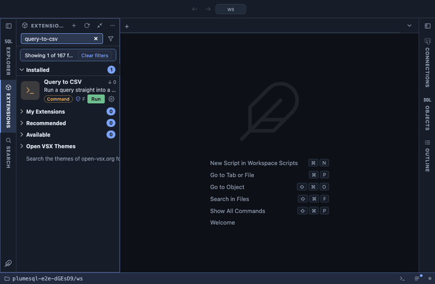

# Query to CSV



Run a query straight into a CSV file, without loading its rows into the
grid. For the extract of fifty million rows that you want in a file and
never on screen: psql streams the rows from the server into the file, so
nothing is kept twice and nothing waits for a grid.

## What it does

An `@for statement` extension: Run Query to CSV in the right-click menu
of a statement in the editor, on its row in the Outline, and in the dots
menu of a result for the statement it came from. It runs psql on the tab's connection, in a terminal of its own:

```
COPY (<the statement>) TO STDOUT WITH (FORMAT csv, HEADER)
```

with the output sent to the file you named. The file has a header line
with the column names, then one line per row, in PostgreSQL's own CSV:
NULL is an empty field, and a value with a comma, a quote or a line
break is quoted. The statement may span as many lines as you like.

## Inputs

| Input | Default | Meaning |
|---|---|---|
| Write to | `query-{timestamp}.csv` | The file to write, in the workspace unless you give a full path. |

The password never appears in the command line: it reaches psql through
the environment (`@env PGPASSWORD={password}`).

## Requirements

`psql` on this machine, at a version not older than the server's:
PlumeSQL finds every PostgreSQL client installation and runs the one that
suits the server. PostgreSQL 13 or newer.

## Notes

The statement must return rows: a `SELECT`, `VALUES`, `TABLE`, or an
`INSERT`, `UPDATE` or `DELETE` with `RETURNING`. A statement that changes
data runs again here and changes it again, which the confirmation says
before anything runs. A statement with parameters (`$1`, `:name`) cannot
run this way: psql has no values for them and says so in the terminal.

It asks before it runs (`@confirm`), says when it is done, and overwrites
a file of the same name. The path you type is passed to psql as an
argument of its own, never inside the SQL, so a space or a quote in it is
just part of the name.

For a result that is already in the grid, Save As in the result's menu
writes the whole result the same way, without running it again. For a
whole table, Export to CSV does it from the table's row in the object
tree.
