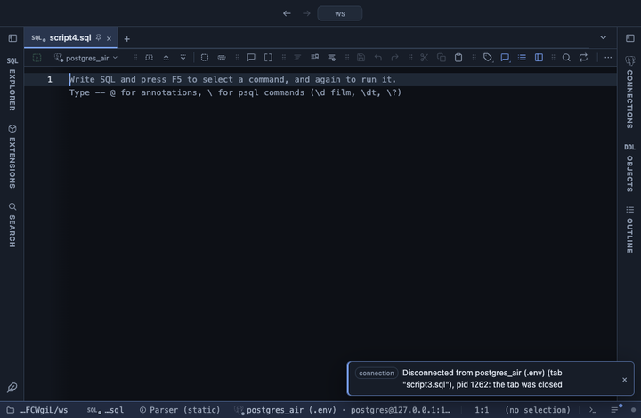

# Change

Adds the change of a numeric column against the previous or the first row, as a difference, a percent or both. Month over month, day over day, or growth since the start, without `lag()`.

## What it shows

A **Change** tab beside the grid, itself a grid: every column and row of the result in its order, with `<column> Δ` and `<column> Δ %` right after the chosen column. A rise reads green with ▲, a fall red with ▼; no change and a missing value stay plain. The value behind each cell is the signed number, so copy and filter read `-12.5`.

Against the **previous row**, each row is compared with the row above it, the first row has no change, and a NULL above gives none either (like `lag()`). Against the **first row**, each row is compared with the first value of the result. With a Group column the comparison stays within each group, in the order the rows come. The percent is the difference over the absolute base, so a move from -10 to -5 is +50 %; a base of zero gives no percent.

## Inputs

| Input | `@inputs` key | Default | Meaning |
|---|---|---|---|
| Column | `column` | asked | Numeric column whose change is shown |
| Compared with | `vs` | previous row | previous row: the row just above (in the same group); first row: the first value of the result or of the group |
| Show | `show` | both | The difference, the change in percent, or both columns |
| Group | `group` | none | Column whose values split the rows into groups, each compared within itself |

## Requirements

PostgreSQL 13 or newer. No server side: the result's sandbox computes it from the rows already fetched.

## Notes

Order the query the way the comparison should walk (`order by region, month`); the rows are never sorted here. The first 100,000 rows are listed. From a script: `-- @extension change` above the query, and `-- @inputs column=revenue, vs=first row, group=region` to answer the inputs in the file. A pipeline charts the change: `-- @extension change | echarts`.
