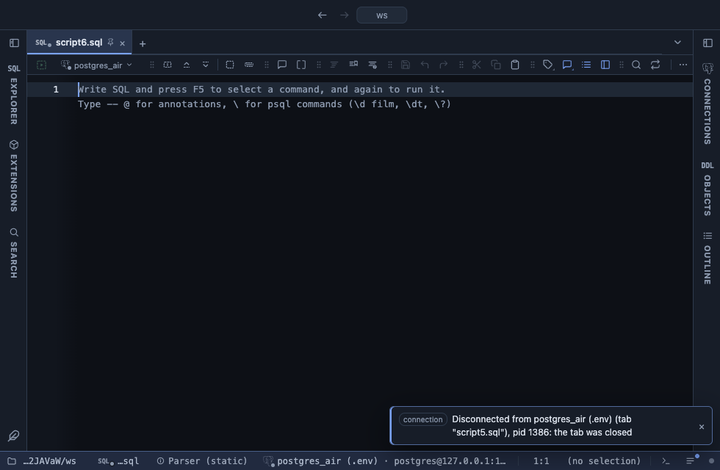

# Moving average

Adds a column with the moving average of a numeric column over a window of rows, trailing or centered. What a spreadsheet's trendline or `avg(x) over (rows between 6 preceding and current row)` gives, picked from a form.

## What it shows

A **Moving average** tab beside the grid, itself a grid: every column and row of the result in its order, with `<column> avg <window>` right after the chosen column (`sales avg 7`). A **trailing** window averages the row and the ones before it; a **centered** one takes rows on both sides (an even window leans one row back). A NULL is skipped, not counted as zero, and a window holding fewer values than **Min periods** stays blank, so the first rows can be left empty rather than averaged over one or two values.

## Inputs

| Input | `@inputs` key | Default | Meaning |
|---|---|---|---|
| Column | `column` | asked | Numeric column to average |
| Window | `window` | 7 | How many rows each average covers |
| Kind | `kind` | trailing | trailing: this row and the ones before it; centered: rows on both sides |
| Min periods | `min` | 1 | How many values a window needs before it shows an average |

## Requirements

PostgreSQL 13 or newer. No server side: the result's sandbox computes it from the rows already fetched.

## Notes

The window walks the rows in the order the result has them, so order the query by time (`order by day`). It counts rows, not days: a missing day is not a gap. The first 100,000 rows are listed. From a script: `-- @extension moving-average` above the query, and `-- @inputs column=sales, window=28, min=28` to answer the inputs in the file. To chart the raw line against the smoothed one: `-- @extension moving-average | echarts`.
