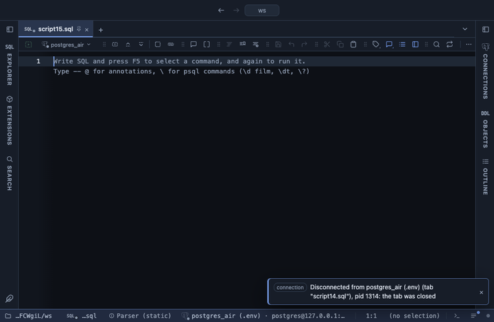

# Percent of total

Adds a column with each row's share of the total, of its group, or as a running percent, with a small bar. The same as a spreadsheet's "Show Values As" percent of total, computed over the whole result.

## What it shows

A **% of total** tab beside the grid, itself a grid: every column and row of the result in its order, with one new column right after the chosen one. The new column is named after the source and the mode (`amount % of total`, `amount % of group`, `amount running %`) and holds a percent from 0 to 100 with two decimals, drawn with a short bar in the theme's accent. The value behind the cell is the plain number, so copy, filter and export read `12.5`. A NULL stays blank and counts for nothing; a total of zero leaves the column blank.

With **group**, each row is a share of its own group's sum, so every group adds up to 100. With **running**, each row shows the running sum so far as a share of the total, reaching 100 on the last row; with a Group column it restarts in each group.

## Inputs

| Input | `@inputs` key | Default | Meaning |
|---|---|---|---|
| Column | `column` | asked | Numeric column whose share is shown |
| Share of | `of` | total | total: of the whole column; group: of the row's group; running: the running sum as a share of the total |
| Group | `group` | none | Column whose values split the rows into groups; each group adds up to 100 |

## Requirements

PostgreSQL 13 or newer. No server side: the result's sandbox computes it from the rows already fetched.

## Notes

The totals read every row the view reads; the grid lists the first 100,000 and the Log says how many were left out. The rows keep the result's order, so for a running percent sort in SQL. From a script: `-- @extension percent-of-total` above the query, and `-- @inputs column=amount, of=group, group=region` to answer the inputs in the file. The table feeds another extension like a result does: `-- @extension percent-of-total | echarts` charts it.
