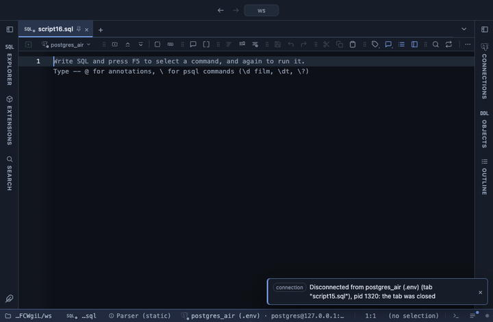

# Rank

Adds a column ranking each row by a numeric column, over the whole result or within each group. A spreadsheet's RANK, or SQL's `rank()` and `dense_rank()`, without writing the window function.

## What it shows

A **Rank** tab beside the grid, itself a grid: every column and row of the result in its order, with `<column> rank` right after the chosen column. Rank 1 is the largest value (or the smallest, ascending), and ranks 1 to 3 are in bold. A NULL gets no rank.

Ties follow one of three conventions: **competition** gives equal values the same rank and skips the next ones (1, 2, 2, 4), **dense** does not skip (1, 2, 2, 3), **average** gives each tied value the mean of the places they share (1, 2.5, 2.5, 4). With a Group column, each group is ranked on its own and starts again at 1.

## Inputs

| Input | `@inputs` key | Default | Meaning |
|---|---|---|---|
| Column | `column` | asked | Numeric column the rows are ranked by |
| Order | `order` | descending | descending ranks the largest value 1; ascending the smallest |
| Ties | `ties` | competition | competition: 1, 2, 2, 4; dense: 1, 2, 2, 3; average: 1, 2.5, 2.5, 4 |
| Group | `group` | none | Column whose values split the rows into groups, each ranked on its own |

## Requirements

PostgreSQL 13 or newer. No server side: the result's sandbox computes it from the rows already fetched.

## Notes

The ranks read every row the view reads; the grid lists the first 100,000. To see the leaders first, sort the rank tab's column in the grid, or order the query. From a script: `-- @extension rank` above the query, and `-- @inputs column=sales, ties=dense, group=region` to answer the inputs in the file. In a pipeline the rank column is a number like any other: `-- @extension rank | echarts`.
