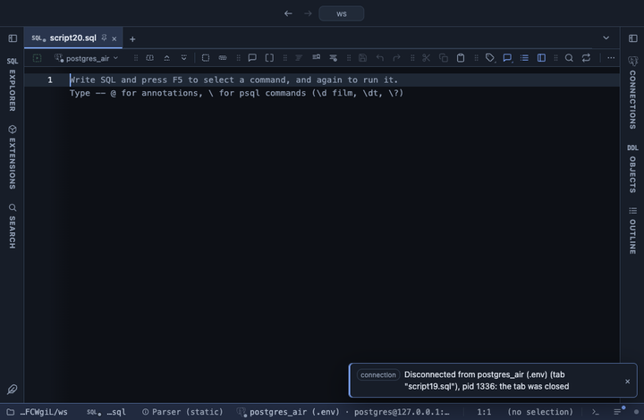

# Totals and subtotals

Adds a Total row under the result, and optional subtotal rows after each group of a column, like a spreadsheet's Subtotal command.

## What it shows

A **Totals** tab beside the grid, itself a grid: every column and row of the result, and a **Total** row frozen at the bottom with the chosen columns folded (a sum by default). The label sits in the first column that is not totalled, a text one when there is one; the other columns of a total row are empty.

With **Subtotal by**, the rows are grouped by that column's value, the groups in the order their first row appears and the rows in their order within each, and a bold `<value> subtotal` row closes every group. The grand Total still folds every row, not the subtotals. Count counts the numbers in a column, as a spreadsheet's COUNT does, so a NULL is not counted.

## Inputs

| Input | `@inputs` key | Default | Meaning |
|---|---|---|---|
| Columns | `columns` | every numeric column | Numeric columns to total; blank totals every numeric column |
| Fold | `agg` | sum | How the values of a total combine |
| Subtotal by | `by` | none | Column whose values group the rows, with a subtotal row after each group |

## Requirements

PostgreSQL 13 or newer. No server side: the result's sandbox computes it from the rows already fetched.

## Notes

The totals fold every row the view reads; the grid lists the first 100,000. In a pipeline the frozen Total row stays behind but the subtotal rows travel with the data, so chart the plain result, or run without Subtotal by: `-- @extension totals | echarts`. From a script: `-- @extension totals` above the query, and `-- @inputs columns=amount, qty, by=region` to answer the inputs in the file. For totals the server computes, `group by rollup (region)` is the SQL answer.
