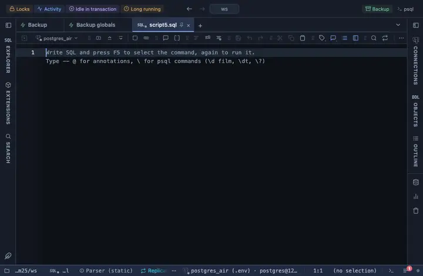

# Bar chart

A tab that DRAWS the rows: an interactive bar chart, hand drawn with no library. The smallest possible chart extension, and the one to read to learn how a view is written.

## What it shows

A **Bars** tab beside the grid: one bar per row for the numeric column you pick. A header button copies the values; clicking a bar selects that row in the grid.

## Inputs

| Input | `@inputs` key | Default | Meaning |
|---|---|---|---|
| Value | `value` | asked |  |
| Top rows | `top` | 50 | How many rows the view reads from the result, from the first one; the rest are left out |

## Requirements

PostgreSQL 13 or newer. The view draws in the result's sandbox; the server is not involved.

## Notes

Hand drawn SVG, both themes. Put `-- @extension bar-chart open` above the query to land on the chart after Run (`only` hides the grid, `beside` splits the two), or attach it from the result's menu. An `-- @inputs` line in the file answers the inputs, so nothing asks; the page lists the lines.
