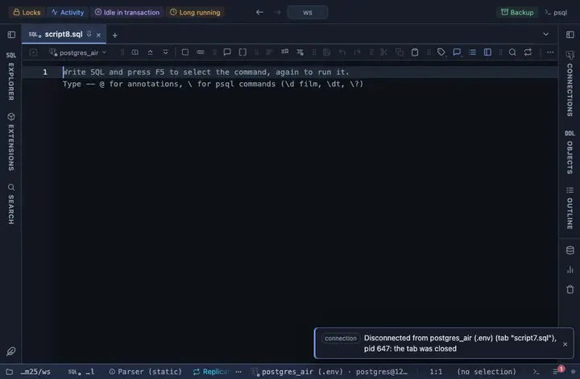

# Chart.js

Bar, line, pie, doughnut, radar and polar area charts with Chart.js, pulled from a CDN. Pick the type, the category column and one or more series; a header button copies the plotted rows.

## What it shows

A **Chart** tab beside the grid, drawn on a canvas by Chart.js 4. One series per numeric column you list; the palette and the title are yours.

## Inputs

| Input | `@inputs` key | Default | Meaning |
|---|---|---|---|
| Chart type | `kind` | bar |  |
| Category (X / label) | `category` | asked | Labels along the axis, one per row |
| Series (Y) | `series` | asked | One series per column; edit the comma list to add or remove one |
| Palette | `palette` | Vivid |  |
| Title | `title` | none |  |
| Top rows | `top` | 60 | How many rows the view reads from the result, from the first one; the rest are left out |

## Requirements

PostgreSQL 13 or newer. Runs entirely in the result's sandbox, with no server side. Loads `cdn.jsdelivr.net` at run time; the host must be on the allowed remote script hosts (the extension's page offers Allow).

## Notes

The library loads once, on the first draw, and is cached after. `-- @extension chartjs` above a query attaches it; `open`, `only` or `beside` after the id says how the tab opens. With `-- @inputs` in the file the chart draws without the dialog. The lines to copy are on the extension's page, and a result's menu can attach it too.
