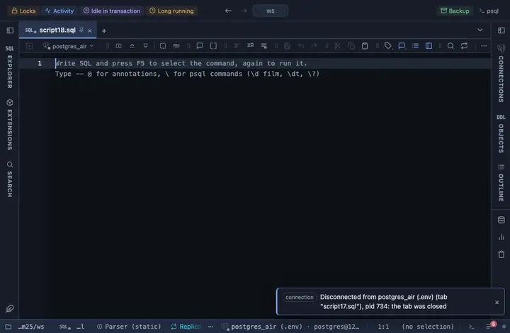

# ECharts

Line, area, bar, scatter and pie with zoom and a range slider, built for a LOT of rows: Apache ECharts, pulled from a CDN. A line of a million points is downsampled on the fly with the peaks kept, scatter and bars use its large mode, and every chart zooms.

## What it shows

An **ECharts** tab beside the grid, drawn on a canvas. Drag the slider below the chart, or wheel and drag on it, to zoom; the tooltip follows the cursor. A timestamp X draws a time axis, a number a numeric one, anything else categories. A header button copies what was drawn.

## Inputs

| Input | `@inputs` key | Default | Meaning |
|---|---|---|---|
| Chart | `kind` | line |  |
| X (a column, or the row order) | `x` | asked | Horizontal axis: a timestamp draws a time axis, a number a numeric one, anything else categories |
| Series (Y) | `series` | asked | One series per column; edit the comma list to add or remove one |
| Palette | `palette` | Vivid |  |
| Title | `title` | none |  |
| Top rows | `top` | 1000000 | How many rows the view reads from the result, from the first one; the rest are left out |

## Requirements

PostgreSQL 13 or newer. No server side: the result's sandbox draws it from the rows already fetched. The library comes from `cdn.jsdelivr.net` when the view draws, so that host has to be allowed first; the extension's page has the Allow button.

## Notes

The whole result is paged in up to Top rows; a million rows draw in about a second. From a script: `-- @extension echarts` (plus `open`, `only` or `beside` for how the view opens) above the query, and `-- @inputs` to answer the inputs in the file so the dialog never shows. From a result: its own menu. The page has every line ready.
