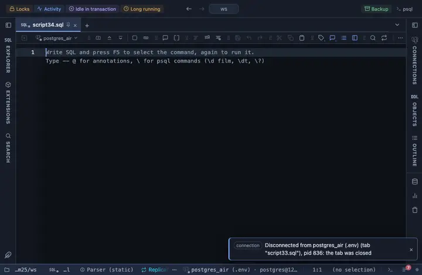

# Heatmap

A grid of two categories coloured by a folded value. The chart is Observable Plot's, fetched from a CDN when the tab opens.

## What it shows

A **Heatmap** tab beside the grid: X and Y categories as the grid, each cell the Value folded into it (a mean by default, or a count without a Value), coloured on the scheme you pick.

## Inputs

| Input | `@inputs` key | Default | Meaning |
|---|---|---|---|
| X (columns of the grid) | `x` | asked |  |
| Y (rows of the grid) | `y` | asked |  |
| Value | `value` | none | Numeric column folded into each cell; without one, a count of rows |
| Per cell | `agg` | mean | How the values of one cell combine |
| Colours | `scheme` | ylgnbu |  |
| Title | `title` | none |  |
| Top rows | `top` | 1000000 | How many rows the view reads from the result, from the first one; the rest are left out |

## Requirements

PostgreSQL 13 or newer. Runs entirely in the result's sandbox, with no server side. Loads `cdn.jsdelivr.net` at run time; the host must be on the allowed remote script hosts (the extension's page offers Allow). Brings the Plot core extension along: the shared helpers the Observable Plot charts are built on.

## Notes

Observable Plot renders SVG, so the view never hands it a million points: the result is read up to Top rows and reduced to the pixels' resolution first. `-- @extension plot-heatmap` above a query attaches it; `open`, `only` or `beside` after the id says how the tab opens. With `-- @inputs` in the file the chart draws without the dialog. The lines to copy are on the extension's page, and a result's menu can attach it too.
