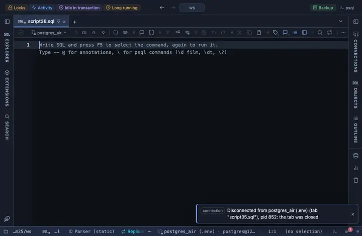

# Ranked

The top N categories by a folded value, as labelled horizontal bars. Drawn with Observable Plot, pulled from a CDN.

## What it shows

A **Ranked** tab beside the grid: the categories are folded (a sum by default, or a count without a Value), ordered, cut to the top N and drawn as labelled bars.

## Inputs

| Input | `@inputs` key | Default | Meaning |
|---|---|---|---|
| Category (one bar each) | `category` | asked |  |
| Value | `value` | none | Numeric column folded into each cell; without one, a count of rows |
| Per category | `agg` | sum | How the values of one category combine |
| Top N | `n` | 25 | How many categories are kept after ordering |
| Order | `order` | largest first |  |
| Palette | `palette` | Vivid |  |
| Title | `title` | none |  |
| Top rows | `top` | 1000000 | How many rows the view reads from the result, from the first one; the rest are left out |

## Requirements

PostgreSQL 13 or newer. Nothing on the server: the view runs in the result's sandbox. Fetches its library from `cdn.jsdelivr.net` at run time. Allow the host once (the page offers it) or the view stays blank. Installs the Plot core extension with it, the shared helpers the Observable Plot charts draw with.

## Notes

Written for a LOT of rows: the whole result is paged in up to Top rows and reduced to what the pixels can show before Observable Plot, an SVG renderer, sees it. Attach it from a script with `-- @extension plot-ranked` above a query (add `open`, `only` or `beside` to open on the view), or from a result's own menu; the extension's page in PlumeSQL lists the lines to paste, and `-- @inputs` answers the inputs in the file so the chart draws with no dialog.
