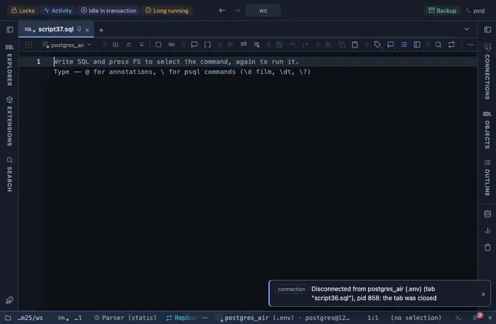

# Regression

A scatter with a fitted trend line and a confidence band, fitted on every row. Observable Plot draws it, loaded from a CDN.

## What it shows

A **Regression** tab beside the grid: the dots are a sample of the rows, the linear fit and its confidence band are computed over every row; an optional group column fits one line per group.

## Inputs

| Input | `@inputs` key | Default | Meaning |
|---|---|---|---|
| X | `x` | asked |  |
| Y | `y` | asked |  |
| Group (optional) | `color` | none |  |
| Dots drawn | `dots` | 15000 | A larger result is sampled down to this many dots |
| Palette | `palette` | Vivid |  |
| Title | `title` | none |  |
| Top rows | `top` | 1000000 | How many rows the view reads from the result, from the first one; the rest are left out |

## Requirements

PostgreSQL 13 or newer. The view draws in the result's sandbox; the server is not involved. Needs `cdn.jsdelivr.net` among the allowed remote script hosts, since the library loads from there when the view opens; Allow is on the extension's page. Depends on the Plot core extension (the helpers every Observable Plot chart here shares), which installs alongside.

## Notes

Made for big results: up to Top rows are paged in and thinned to what the pixels can carry before they reach Observable Plot, which draws SVG and would choke on the raw count. Put `-- @extension plot-regression open` above the query to land on the chart after Run (`only` hides the grid, `beside` splits the two), or attach it from the result's menu. An `-- @inputs` line in the file answers the inputs, so nothing asks; the page lists the lines.
