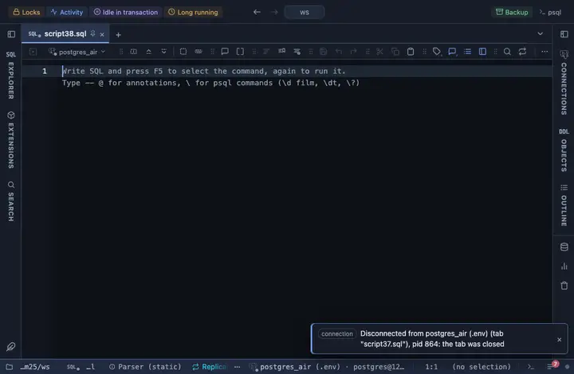

# Ridgeline

The distribution of a value per group, as overlapping ridges. The chart is Observable Plot's, fetched from a CDN when the tab opens.

## What it shows

A **Ridgeline** tab beside the grid: one histogram ridge per group, scaled per group or on a shared scale, with the bin count yours to set.

## Inputs

| Input | `@inputs` key | Default | Meaning |
|---|---|---|---|
| Value | `value` | asked |  |
| Group (one ridge each) | `group` | asked |  |
| Height | `scale` | per group | per group scales each ridge to its own peak; shared uses one scale for all |
| Bins | `bins` | 40 | Histogram bins per ridge |
| Palette | `palette` | Cool |  |
| Title | `title` | none |  |
| Top rows | `top` | 1000000 | How many rows the view reads from the result, from the first one; the rest are left out |

## Requirements

PostgreSQL 13 or newer. Runs entirely in the result's sandbox, with no server side. Loads `cdn.jsdelivr.net` at run time; the host must be on the allowed remote script hosts (the extension's page offers Allow). Brings the Plot core extension along: the shared helpers the Observable Plot charts are built on.

## Notes

Observable Plot renders SVG, so the view never hands it a million points: the result is read up to Top rows and reduced to the pixels' resolution first. `-- @extension plot-ridgeline` above a query attaches it; `open`, `only` or `beside` after the id says how the tab opens. With `-- @inputs` in the file the chart draws without the dialog. The lines to copy are on the extension's page, and a result's menu can attach it too.
