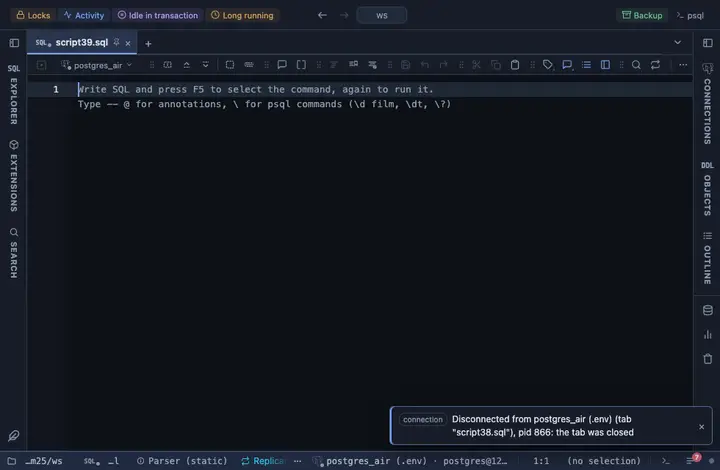

# Streamgraph

Series stacked as flowing bands over x, bucket-averaged for a lot of rows. Rendered by Observable Plot (a CDN load).

## What it shows

A **Streamgraph** tab beside the grid: the series are stacked into flowing bands over a timestamp, a number or the row order, averaged into buckets so a million rows read as a shape.

## Inputs

| Input | `@inputs` key | Default | Meaning |
|---|---|---|---|
| X (a column, or the row order) | `x` | asked | Horizontal axis: a timestamp draws a time axis, a number a numeric one, anything else categories |
| Series (Y) | `series` | asked | One series per column; edit the comma list to add or remove one |
| Palette | `palette` | Vivid |  |
| Title | `title` | none |  |
| Top rows | `top` | 500000 | How many rows the view reads from the result, from the first one; the rest are left out |

## Requirements

PostgreSQL 13 or newer. No server side: the result's sandbox draws it from the rows already fetched. The library comes from `cdn.jsdelivr.net` when the view draws, so that host has to be allowed first; the extension's page has the Allow button. The Plot core extension installs with it; that is where the helpers common to the Observable Plot charts live.

## Notes

Sized for a lot of rows. The rows are paged in up to Top and bucketed down to what fits the pixels before Observable Plot, an SVG renderer, gets them. From a script: `-- @extension plot-streamgraph` (plus `open`, `only` or `beside` for how the view opens) above the query, and `-- @inputs` to answer the inputs in the file so the dialog never shows. From a result: its own menu. The page has every line ready.
