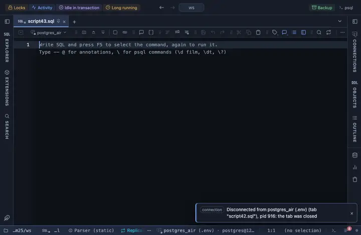

# SandDance

A 2D and 3D explorer for very large results: scatter, bars, stacks,
treemap, density and small multiples, drawn with WebGL from Microsoft's
SandDance. Attach it to a query and the result gets a SandDance tab
beside the grid, animating between any two settings you pick.

## What it shows

A result view (`views` in the module) named **SandDance**. Its inputs are
SandDance's own knobs:

| Input | `@inputs` key | Default | Meaning |
|---|---|---|---|
| Chart | `chart` | scatterplot | scatterplot, barchart (picks horizontal or vertical), barchartV, barchartH, density, stacks, strips, grid, treemap. |
| View | `view` | 3d | 3d rotates with a right drag; 2d is flat. |
| X, Y | `x`, `y` | first columns | The columns on the two axes. |
| Z (height, 3D) | `z` | none | The column drawn as height in the 3d view. |
| Colour | `color` | none | The column the marks are coloured by. |
| Size | `size` | none | A numeric column that scales each mark. |
| Sort by | `sort` | none | The column the marks are ordered by. |
| Facet | `facet` | none | Splits the chart into a grid of small multiples, one per distinct value. |
| Colours | `scheme` | category20 | A Vega colour scheme: category and tableau sets are categorical, the rest are ramps for numbers. |
| Top rows | `top` | 20000 | How many rows the view reads from the result, from the first one. |

The view redraws in place when the pane is resized. Because a right drag
rotates the 3D scene, a right-click opens no PlumeSQL menu inside the view;
the view's menu is the dots button in its header.

## Using it

From a query: `-- @extension sanddance` above the statement adds the
view as a tab beside the grid, `-- @extension sanddance open` opens on it,
`-- @extension sanddance only` shows it alone, `-- @extension sanddance
beside` draws it beside the grid. In the file's header the same lines
apply to every query in the file. The input form opens the first time;
`-- @inputs x=col, y=col, chart=barchart` answers it in the file, by the
keys in the table above, and `-- @noask` keeps it closed.

## Requirements

A GPU-capable browser: the desktop app, or a normal browser tab. The view
loads Vega and the SandDance bundle (about 1.9 MB, once, cached after)
from `cdn.jsdelivr.net`, so that host must be allowed
(`extensions.remoteScriptHosts`; a blocked host offers "Allow host" in
the Log). No database requirement: it reads the result rows only.

## Notes

Raise **Top rows** for a really large result; SandDance is built for a
lot of points. Numeric cells are coerced to numbers for the axes; text
stays categorical. The chart and column vocabulary is documented at
https://microsoft.github.io/SandDance and the scheme names at
https://vega.github.io/vega/docs/schemes.
