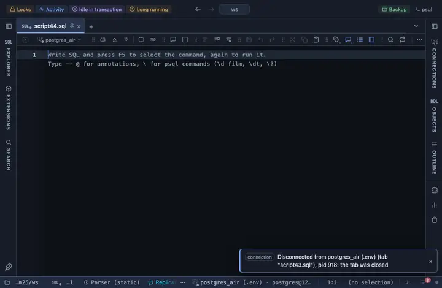

# Scatter GL

A million points on the GPU: pan, zoom, hover the nearest row and click to select it. Hand written WebGL, no library and nothing to fetch.

## What it shows

A **Scatter GL** tab beside the grid. One vertex per row goes to the GPU once, so a million points pan and zoom at full frame rate. Wheel to zoom around the cursor, drag to pan, double-click to reset; hover reads the nearest row, a click selects it in the grid. Colour by any column: a category gets a palette colour each (up to twelve), a number a ramp.

## Inputs

| Input | `@inputs` key | Default | Meaning |
|---|---|---|---|
| X | `x` | asked |  |
| Y | `y` | asked |  |
| Colour | `color` | none | Column the points are coloured by |
| Point size (px) | `size` | 3 |  |
| Top rows | `top` | 1000000 | How many rows the view reads from the result, from the first one; the rest are left out |

## Requirements

PostgreSQL 13 or newer. Nothing on the server: the view runs in the result's sandbox. A GPU-capable browser: the desktop app, or a normal browser tab.

## Notes

The whole result is paged in up to Top rows. Attach it from a script with `-- @extension scatter-gl` above a query (add `open`, `only` or `beside` to open on the view), or from a result's own menu; the extension's page in PlumeSQL lists the lines to paste, and `-- @inputs` answers the inputs in the file so the chart draws with no dialog.
