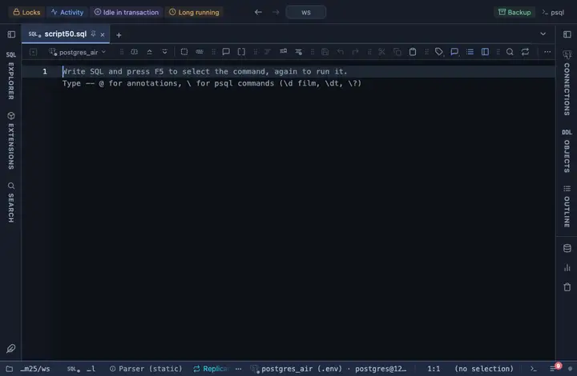

# μPlot

A line chart built for speed: a million points in milliseconds, drag to zoom, a live legend. μPlot, a 45 KB canvas library pulled from a CDN, built for exactly one thing: a lot of points, fast.

## What it shows

A **μPlot** tab beside the grid. Drag across the chart to zoom into a range (double-click to reset), hover for the crosshair and the live legend, click a legend entry to hide its series. X is a timestamp (a time axis), a number, or the row order.

## Inputs

| Input | `@inputs` key | Default | Meaning |
|---|---|---|---|
| X (a timestamp, a number, or the row order) | `x` | asked | Horizontal axis: a timestamp draws a time axis, a number a numeric one, anything else categories |
| Series (Y) | `series` | asked | One series per column; edit the comma list to add or remove one |
| Palette | `palette` | Vivid |  |
| Title | `title` | none |  |
| Top rows | `top` | 1000000 | How many rows the view reads from the result, from the first one; the rest are left out |

## Requirements

PostgreSQL 13 or newer. The view draws in the result's sandbox; the server is not involved. Fetches its library from `cdn.jsdelivr.net` at run time. Allow the host once (the page offers it) or the view stays blank.

## Notes

μPlot's stylesheet is inlined in the extension, since the sandbox cannot fetch it. Put `-- @extension uplot open` above the query to land on the chart after Run (`only` hides the grid, `beside` splits the two), or attach it from the result's menu. An `-- @inputs` line in the file answers the inputs, so nothing asks; the page lists the lines.
