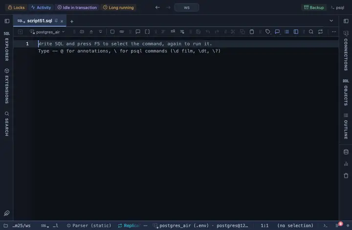

# Vega-Lite

Bar, line, area, point and tick charts with Vega-Lite, which groups and aggregates for you: pick the mark or leave it on auto, the X and Y columns, an optional colour column and how rows sharing an X fold into one Y.

## What it shows

A **Vega** tab beside the grid. Auto draws bars for a category X, a line over time, points otherwise; the aggregate folds repeated categories (the mean by default). The chart fits the pane, follows the theme, and draws on a canvas past a few thousand rows.

## Inputs

| Input | `@inputs` key | Default | Meaning |
|---|---|---|---|
| Mark | `mark` | auto | auto draws bars for a category X, a line over time, points otherwise |
| X | `x` | asked |  |
| Y | `y` | asked |  |
| Colour | `color` | none | Column the marks are coloured by |
| Aggregate Y | `agg` | auto | How rows sharing an X fold into one Y; auto takes the mean when a category repeats, else none |
| Title | `title` | none |  |
| Top rows | `top` | 20000 | How many rows the view reads from the result, from the first one; the rest are left out |

## Requirements

PostgreSQL 13 or newer. Runs entirely in the result's sandbox, with no server side. Loads the Vega runtime from `cdn.jsdelivr.net` at run time; the host must be on the allowed remote script hosts (the extension's page offers Allow).

## Notes

The Vega runtime loads the classic-script way, three scripts once, cached after. `-- @extension vega-lite` above a query attaches it; `open`, `only` or `beside` after the id says how the tab opens. With `-- @inputs` in the file the chart draws without the dialog. The lines to copy are on the extension's page, and a result's menu can attach it too.
