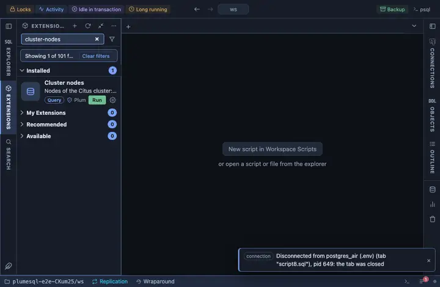

# Cluster nodes

The nodes of a Citus cluster: the coordinator and every worker, with
their group, role, whether each is active and whether it holds shards.
The first look at a cluster you did not set up yourself.

## What it shows

One row per node, by group then id:

| Column | Meaning |
|---|---|
| id, node | The node's id and its `host:port`. |
| group | Its group; a worker and its replicas share one. |
| role | `primary` or `secondary`. |
| cluster | The cluster name (`default` unless you run several). |
| active | Whether Citus routes to it. |
| holds shards | Whether the rebalancer may place shards on it (a coordinator usually does not). |
| has metadata, metadata synced | Whether the node carries the distributed metadata and whether it is current. |

## Requirements

PostgreSQL 13 or newer with the `citus` extension; without it the run
answers with the server's own error. Reading `pg_dist_node` needs
superuser or the `citus` metadata privileges a hosted service grants.

## Notes

Reads only. `pg_dist_node` is the extension's own catalog; it lives in
`pg_catalog` wherever Citus was installed, so it is qualified.
