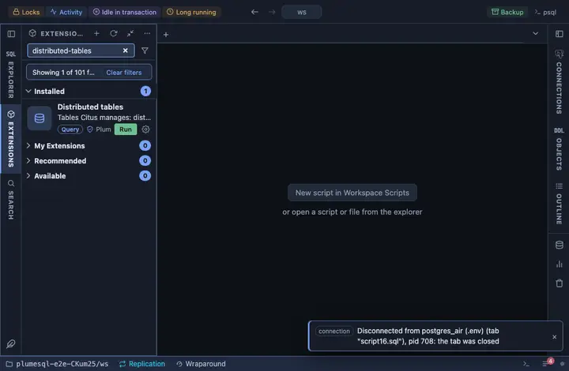

# Distributed tables

The tables Citus manages: distributed by which column into how many
shards, reference and local ones, with their sizes across every shard
and their co-location groups; and any table's shards one click away.

## What it shows

One row per table Citus knows:

| Column | Meaning |
|---|---|
| table | Its name. |
| kind | `distributed`, `reference` or `local`. |
| distributed by | The distribution column, for a distributed table. |
| shards | How many shards. |
| co-location | The co-location group; tables in one group join locally. |
| size | The table's size summed over every shard, which is the question the coordinator alone cannot answer. |
| owner, access method | As for any table. |

**Shards** on a table opens its shards: the shard table each one is,
the node it lives on and its size.

## Requirements

PostgreSQL 13 or newer with the `citus` extension; without it the run
answers with the server's own error. Sizes are read from the workers, so
the coordinator's role must reach them.

## Notes

Reads only. The `citus_tables` view is deliberately not schema
qualified: it lives where the extension was installed, and only the
server knows where.
