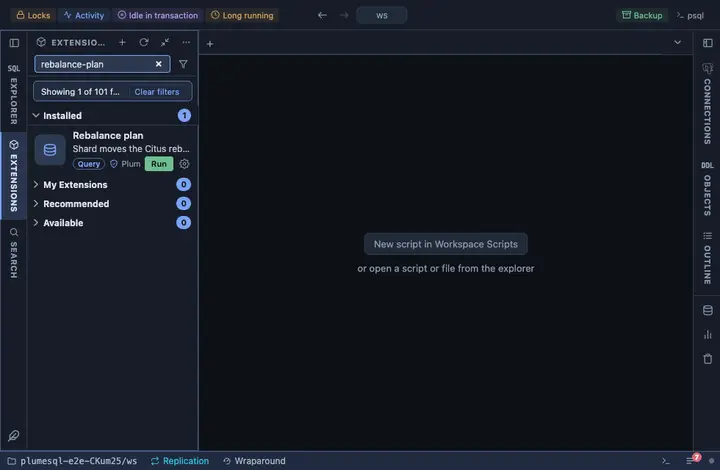

# Rebalance plan

The shard moves the Citus rebalancer would make now, without making
them: which shard, from which node to which, and its size. A plan,
never a move; the look before you start a rebalance, and the check
that a cluster is balanced.

## What it shows

One row per move the rebalancer would make:

| Column | Meaning |
|---|---|
| table | The distributed table. |
| shard | The shard's id. |
| size | What would travel. |
| from, to | The source and the target node, as `host:port`. |

An empty result means the cluster is balanced by the rebalancer's
current strategy.

## Requirements

PostgreSQL 13 or newer with the `citus` extension; without it the run
answers with the server's own error. Runs on the coordinator.

## Notes

Reads only: the rebalancer itself runs from `citus_rebalance_start()`,
a call this extension does not make. The function is the extension's
own and deliberately not schema qualified.
