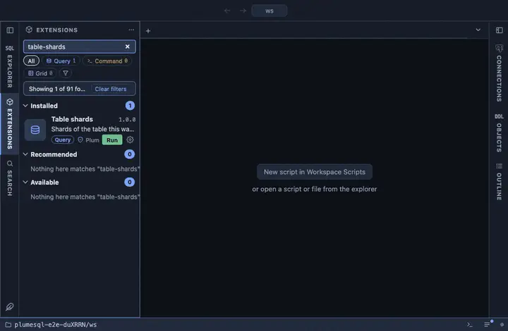

# Table shards

The shards of the Citus table this was opened on: the shard table each
one is, the node it lives on and its size. From a distributed or
reference table's row in the object tree.

## What it shows

One row per shard, by id:

| Column | Meaning |
|---|---|
| shard | The shard's id. |
| shard table | The physical table on its node (`name_102008` and so on). |
| node | Where it lives, as `host:port`. |
| size | Its size on that node. |

## Requirements

PostgreSQL 13 or newer with the `citus` extension. Sizes are read from
the workers.

## Notes

Reads only. An `@for distributed table, reference table` extension:
`{object}` is the table it was opened on, bound as a parameter. The
`citus_shards` view lives in `pg_catalog` wherever Citus was installed,
so it is qualified.
