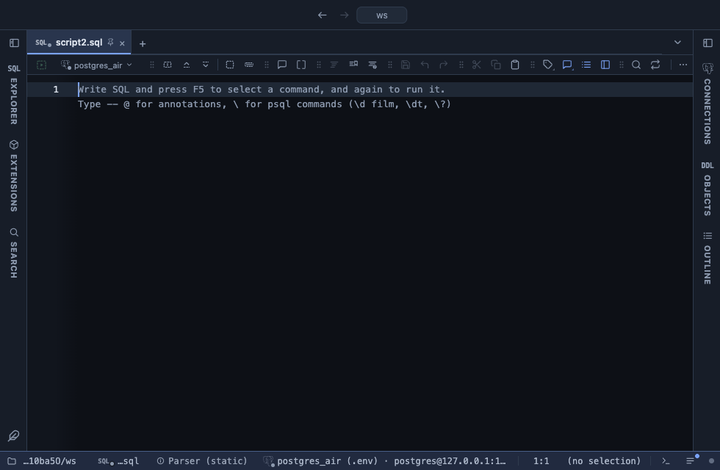

# Funnel

Stages narrowing from first to last: visits, signups, orders. Each stage is labelled with its value, its share of the first stage and its share of the stage before it. Drawn with Apache ECharts, pulled from a CDN.

## What it shows

A **Funnel** tab beside the grid, one band per stage, its width the stage's value. The value is the sum of the value column per stage, or the count of rows per stage when no value column is picked, so the raw event rows can go in as they are. Stages keep the order they first appear in, or sort from largest to smallest. Up to 50 stages. A header button copies the stages with both percentages as CSV.

## Inputs

| Input | `@inputs` key | Default | Meaning |
|---|---|---|---|
| Stage | `stage` | asked | The column naming the stage of each row |
| Value | `value` | none | Numeric column summed per stage; without one, a count of rows per stage |
| Stage order | `sort` | as seen | as seen keeps the order the stages first appear in; descending sorts them by value |
| Title | `title` | none |  |

## Requirements

PostgreSQL 13 or newer. No server side: the result's sandbox draws it from the rows already fetched. ECharts comes from `cdn.jsdelivr.net` when the view draws, so that host has to be allowed first; the extension's page has the Allow button. Brings the Stats core extension along: the shared helpers that read the rows.

## Notes

A stage that grows past the one before it shows more than 100% of previous; the band is still drawn to scale. From a script: `-- @extension funnel` (plus `open`, `only` or `beside` for how the view opens) above the query, and `-- @inputs` to answer the inputs in the file so the dialog never shows. From a result: its own menu. The page has every line ready.
