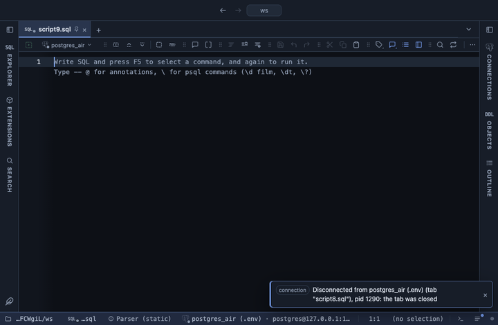

# Gauge

One number on a dial: the last value of a column, or its sum, mean, minimum or maximum, with an optional target mark and bands that colour the dial green, amber and red. Drawn with Apache ECharts, pulled from a CDN.

## What it shows

A **Gauge** tab beside the grid with the number large in the middle. Without band limits the dial fills up to the value in the accent colour. With one or two limits (`60,85`) the dial is split into two or three bands and a needle points at the value, which takes the colour of its band; Good is says which end is green. A target shows as a short mark on the arc, named below the dial. The dial starts at 0 unless told otherwise and ends at a round number above the value (and the target) unless an end is given. A header button copies the number and the dial's range as CSV.

## Inputs

| Input | `@inputs` key | Default | Meaning |
|---|---|---|---|
| Value | `value` | asked | The numeric column the number comes from |
| Which number | `agg` | last | The last or first row's value, or a fold over every row |
| Dial start | `min` | 0 |  |
| Dial end | `max` | none | Blank picks a round number above the value |
| Target | `target` | none | A marker on the dial; blank for none |
| Band limits | `thresholds` | none | One or two values splitting the dial into coloured bands, like 60,85; blank for a plain dial |
| Good is | `good` | high | Which end of the dial is green |
| Title | `title` | none |  |

## Requirements

PostgreSQL 13 or newer. No server side: the result's sandbox draws it from the rows already fetched. ECharts comes from `cdn.jsdelivr.net` when the view draws, so that host has to be allowed first; the extension's page has the Allow button. Brings the Stats core extension along: the shared helpers that read the rows.

## Notes

For a live number, pair it with a query extension's `@refresh` timer and the dial moves with each run. From a script: `-- @extension gauge` (plus `open`, `only` or `beside` for how the view opens) above the query, and `-- @inputs` to answer the inputs in the file so the dialog never shows. From a result: its own menu. The page has every line ready.
