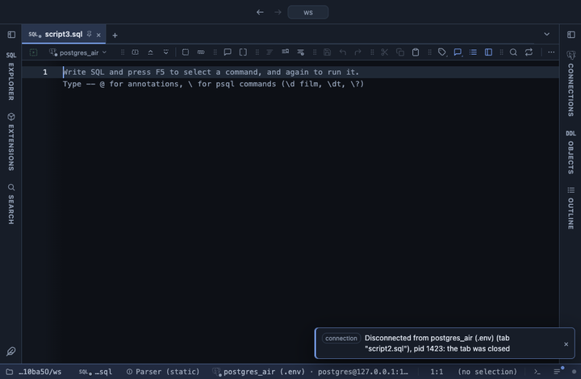

# KPI cards

Big-number cards for a dashboard, one per numeric column: the last value (or a sum, a mean, a count) in large type, the change against the previous or first row, and a sparkline of the column underneath. Hand written, no library.

## What it shows

A **KPI cards** tab beside the grid with up to eight cards in a grid that reflows with the pane's width. Each card has its title (the column name, or your own), the number, and under it either the change against the reference row, a green ▲ or a red ▼ with the percentage and the reference value, or what the number is (`last of 30 rows`). With three rows or more a sparkline draws the whole column, oldest row on the left, so sort by time in SQL. A header button copies the cards as CSV.

## Inputs

| Input | `@inputs` key | Default | Meaning |
|---|---|---|---|
| Values | `values` | every numeric column | One card per column; blank for every numeric column (up to 8) |
| Card number | `agg` | last | The last or first row's value, or a fold over every row |
| Change against | `compare` | none | Shows the change in % from that row's value of the same column |
| Card titles | `labels` | none | A comma list replacing the column names, in card order; blank keeps the names |
| Number format | `format` | number |  |
| Title | `title` | none |  |

## Requirements

PostgreSQL 13 or newer. No server side: the result's sandbox draws it from the rows already fetched. Brings the Stats core extension along: the shared helpers that read the rows.

## Notes

The change compares the card's number with the value the same column has in the reference row: previous row is the one before the last (or after the first, when the card shows the first), first row the first one; nulls are skipped. compact reads 1.2k and 3.4M, percent reads a fraction as a share (0.23 is 23%), currency is in dollars. A count card shows no change. From a script: `-- @extension kpi-cards` (plus `open`, `only` or `beside` for how the view opens) above the query, and `-- @inputs` to answer the inputs in the file so the dialog never shows. From a result: its own menu. The page has every line ready.
