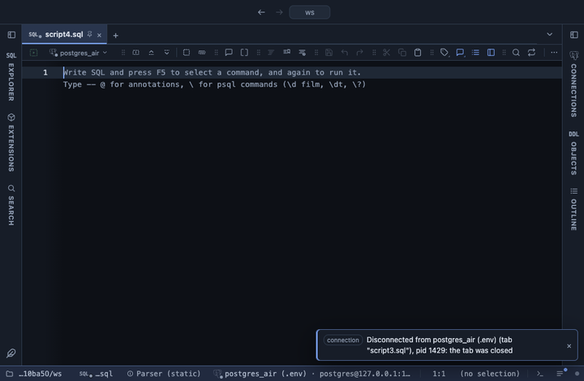

# Pareto

Which few categories make up most of the total: bars from largest to smallest with a line of the cumulative share on a second axis and a dashed mark at 80%. Drawn with Apache ECharts, pulled from a CDN.

## What it shows

A **Pareto** tab beside the grid. The value column is summed per category (or the rows counted, without one), the categories sorted from largest down, and the smallest ones past Top categories folded into one Other bar at the end. The line climbs from the first bar's share to 100%; where it crosses the 80% mark is where the vital few end. The tooltip shows each bar's value, its share and the cumulative share. Categories with a zero or negative total are left out and counted in the Log. A header button copies the table behind the chart as CSV.

## Inputs

| Input | `@inputs` key | Default | Meaning |
|---|---|---|---|
| Category | `category` | asked | The column whose values become the bars |
| Value | `value` | none | Numeric column summed per category; without one, a count of rows |
| Top categories | `n` | 30 | How many of the largest categories get a bar of their own; the rest are folded into Other |
| Title | `title` | none |  |

## Requirements

PostgreSQL 13 or newer. No server side: the result's sandbox draws it from the rows already fetched. ECharts comes from `cdn.jsdelivr.net` when the view draws, so that host has to be allowed first; the extension's page has the Allow button. Brings the Stats core extension along: the shared helpers that read the rows.

## Notes

The raw rows can go in as they are: the view does the grouping, so `select reason from support_tickets` is enough. From a script: `-- @extension pareto` (plus `open`, `only` or `beside` for how the view opens) above the query, and `-- @inputs` to answer the inputs in the file so the dialog never shows. From a result: its own menu. The page has every line ready.
